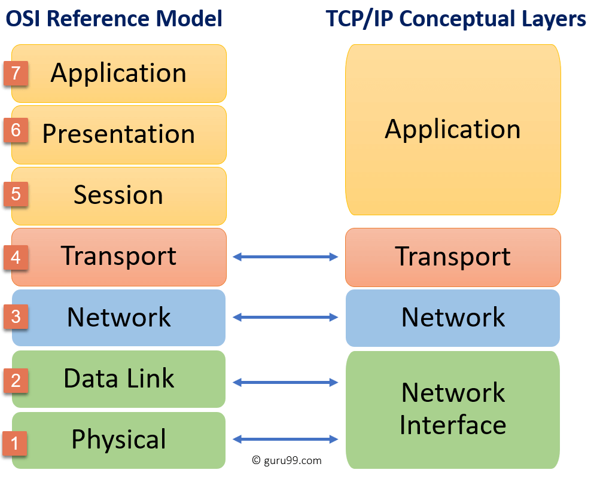

# 2. OSI 7계층

국제표준화기구 ISO 에서 개발한 모델로, 네트워크에서 통신이 일어나는 과정을 7단계로 나눈 것이다. 계층 모델에 의해 프로토콜도 계층별로 구성된다.

네트워크 통신을 계층화해 계층 별 독립적인 역할 분담과 문제발생시 원인 파악을 용이하게 하기 위해 개발한 표준 규격이다.

OSI 7 계층은 물리 계층, 데이터 링크 계층, 네트워크 계층, 전송 계층, 세션 계층, 표현 계층, 응용 계층으로 구성되어 있다.

## 1) 프로토콜이란
**프로토콜이란 메시지를 주고 받는 양식이나 규칙을 의미하는 통신 규약**이다. 이 규칙을 정의한 것이 프로토콜이고 이 규칙은 계층별로 다르게 존재한다.

## 2) OSI 7 계층의 구조

### 7️⃣ 응용 계층(Application Layer) 
> message / HTTP, SMTP, FTP, SIP
- 통신의 최종 목적지로, 응용 프로그램들이 통신으로 활용하는 계층
- 사용자에게 가장 가까운 계층이며 웹 브라우저, 응용 프로그램을 통해 사용자와 직접적으로 상호작용함
- 많은 프로토콜이 존재하는 계층으로, 새로운 프로토콜 추가도 굉장히 쉬움

### 6️⃣ 표현 계층(Presentation Layer)
> message / ASCII, MPEG
- 데이터의 암호화, 복호화와 같이 응용 계층에서 교환되는 데이터의 의미를 해석하는 계층
- 응용 프로그램 ⇔ 네트워크 간 정해진 형식대로 데이터를 변환
  - 송/수신측간 데이터 형식을 정의
  - 수신한 데이터를 변환, 검색, 암호화, 압축 등의 과정을 거져 올바른 방식으로 변환
  - 문자의 인코딩 방식을 변환

### 5️⃣ 세션 계층(Session Layer)
> message / NetBIOS, TLS
- 데이터 교환의 경계와 동기화를 제공하는 계층
  - 포트번호를 기반으로 통신 세션을 구성하고 상호작용과 동기화 제공. 연결 세션에서 에러복구, 데이터 교환을 담당.
- TCP/IP 세션을 만들고 없애는 책임을 지니고 있음
- 연결이 손실되는 경우 연결 복구를 시도함
  - 오랜 시간 연결이 되지 않으면 세션 계층의 프로토콜이 연결을 닫고 다시 연결을 재개
- 데이터를 상대방이 보내고 있을 때 동시에 보낼지에 대한 전이중(동시에 보냄, 전화기), 반이중(동시에 보내지 않음, 무전기) 통신을 결정할 수 있음

### 4️⃣ 전송 계층(Transport Layer)
> segment / TCP, UDP, SCTP
- 상위 계층의 메시지를 하위 계층으로 전송하는 계층
- 메시지의 오류를 제어하며, 메시지가 클 경우 이를 나눠서(Segmentation) 네트워크 계층으로 전달함. 그리고 받은 패킷을 재조립해서 상위 계층으로 전달
  - 양 끝단(End to end)의 사용자들이 신뢰성 있는 데이터를 주고 받을 수 있도록 해주어, 상위 계층들이 데이터 전달의 유효성이나 효율성을 생각하지 않도록 해줌

- 대표적으로 TCP, UDP 프로토콜이 있음
  - TCP : 연결 지향형 통신, 신뢰성
  - UDP : 비연결형 통신, 비신뢰성, 실시간

### 3️⃣ 네트워크 계층(Network Layer)
> datagram, packet / IP, ICMP, ARP, RIP, BGP
- 기기간 연결을 위한 주소와 경로를 정하는 방법을 규정
  - 최적 경로 설정, 패킷 정보 전송, 라우팅, 흐름 제어, 오류 제어, 세그먼테이션 등
- 패킷을 한 호스트에서 다른 호스트로 라우팅하는 계층(여러 라우터를 통한 라우팅, 그를 통한 패킷 전달)
- 여러개의 노드를 거칠 때 마다 경로를 찾는 역할
- 전송 계층에게 전달 받은 목적지 주소를 이용해서 패킷을 만들고 그 목적지의 전송 계층으로 패킷을 전달
- 데이터를 목적지까지 가장 안전하고 빠르게 전달하는 기능을 담당
- 인터넷의 경우 IP 프로토콜이 대표적

### 2️⃣ 데이터 링크 계층(Data Link Layer)
> frame / PPP, Ethernet, Token ring, IEE 802.11(Wifi)
- 데이터를 frame 단위로 한 네트워크 요소에서 이웃 네트워크 요소로 전송하는 계층
- Ethernet은 MAC 주소를 이용해 Node-to-Node, Point-to-Point로 프레임을 전송
- 이 계층의 장비로 대표적인 것은 스위치, 브릿지
- 물리 계층을 통해 전달 받은 정보의 전송 오류를 감지
- 인터넷의 경우 Ethernet 프로토콜이 대표적

### 1️⃣ 물리 계층(Physical Layer)
>  bit / DSL, ISDN
- 장치 간 전기적 신호를 전달하는 계층
  - 디지털 비트를 전기/무선/광 신호로 변환 하는 기능 수행
- 네트워크의 기본 네트워크 하드웨어 전송 기술
- 네트워크의 높은 수준의 기능의 논리 데이터 구조를 기초로 하는 필수 계층
- 데이터 프레임 내부의 각 bit를 한 노드에서 다음 노드로 실제로 이동시키는 계층
- 인터넷의 Ethernet 또한 여러가지 물리 계층 프로토콜을 갖고 있음
- 이 계층의 장비로 대표적인 것은 허브, 리피터