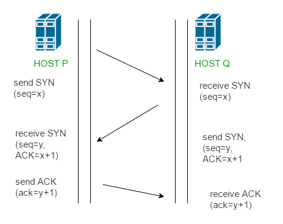
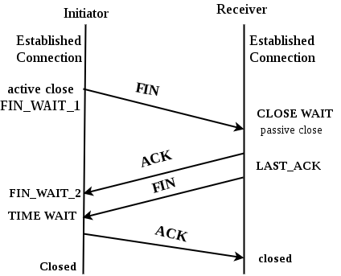

# 3. TCP
전송 제어 프로토콜. Transmission Control Protocol을 줄여 TCP라고 부른다.

TCP는 OSI 7계층에서 4계층인 전송 프로토콜에 해당한다.

Internet Protocol인 IP와 함께 쓰인다. 흔히들 TCP/IP라고 칭한다. 
TCP/IP에서 TCP는 데이터의 조각들을 reliable하게 전송하기 위한 프로토콜이고, IP는 데이터를 빠르게 목적지까지 전송하기 위한 프로토콜이다. (TCP에서 이러한 데이터의 조각들을 TCP Segment라고 칭한다.)

인터넷 상에서, 이를 묶어서 데이터 통신에 사용하는 것이 TCP/IP 프로토콜이다.

## 1) TCP
- TCP는 네트워크 계층 중 전송 계층에서 사용하는 프로토콜 중 하나로, 신뢰성을 보장하는 연결형 서비스
- 1:1 통신 방식. 연결 후 통신
- 인터넷 환경(http, http/2)에서 기본으로 사용
- 가상 회선 방식을 제공 -> 패킷 사이 순서 보장
  - 가상회선 패킷 교환 방식
    - 각 패킷에는 가상회선 식별자가 포함
    - 모든 패킷을 전송하면 가상회선이 해제되고 패킷들은 전송된 순서대로 도착하는 방식
- host간 신뢰성있는 데이터 전달과 흐름제어 및 혼잡제어를 제공
- 연속성보다 신뢰성 있는 전송이 중요할 때에 사용하는 프로토콜(ex. WEB 통신, 파일 전송)
- 연결의 설정(3-hand-shaking)과 해제(4-hand-shaking)
- 인터넷 상에서 데이터를 메세지의 형태(세그먼트 라는 블록 단위)로 보내기 위해 IP와 함께 사용하는 프로토콜
  - IP가 데이터의 배달을 처리한다면 TCP는 패킷을 추적 및 관리
- 전이중(Full-Duplex)
  - 전송이 양방향으로 동시에 일어날 수 있음
- 점대점(Point to Point) 방식
  - 각 연결이 정확히 2개의 종단점을 가지고 있음
- 멀티캐스팅이나 브로드캐스팅을 지원하지 않음
- UDP보다 속도가 느림

## 2) TCP의 3 way handshake와 4 way handshake
연결을 성립하고 해제하는 과정

### 3 way handshake - 연결 성립
TCP는 정확한 전송을 보장해야 한다. 따라서 통신하기에 앞서, 논리적인 접속을 성립하기 위해 3 way handshake 과정을 진행한다.

1. 클라이언트가 서버에게 SYN 패킷을 보냄 (sequence : x)

2. 서버가 SYN(x)을 받고, 클라이언트로 받았다는 신호인 ACK와 SYN 패킷을 보냄 (sequence : y, ACK : x + 1)

3. 클라이언트는 서버의 응답은 ACK(x+1)와 SYN(y) 패킷을 받고, ACK(y+1)를 서버로 보냄

이렇게 3번의 통신이 완료되면 연결이 성립된다. (3번이라 3 way handshake인 것)

### 4 way handshake - 연결 해제
연결 성립 후, 모든 통신이 끝났다면 해제해야 한다.

1. 클라이언트는 서버에게 연결을 종료한다는 FIN 플래그를 보낸다.

2. 서버는 FIN을 받고, 확인했다는 ACK를 클라이언트에게 보낸다. (이때 모든 데이터를 보내기 위해 CLOSE_WAIT 상태가 된다)

3. 데이터를 모두 보냈다면, 연결이 종료되었다는 FIN 플래그를 클라이언트에게 보낸다.

4. 클라이언트는 FIN을 받고, 확인했다는 ACK를 서버에게 보낸다. (아직 서버로부터 받지 못한 데이터가 있을 수 있으므로 TIME_WAIT을 통해 기다린다.)

5. 서버는 ACK를 받은 이후 소켓을 닫는다 (Closed)

6. TIME_WAIT 시간이 끝나면 클라이언트도 닫는다 (Closed)

이렇게 4번의 통신이 완료되면 연결이 해제된다.