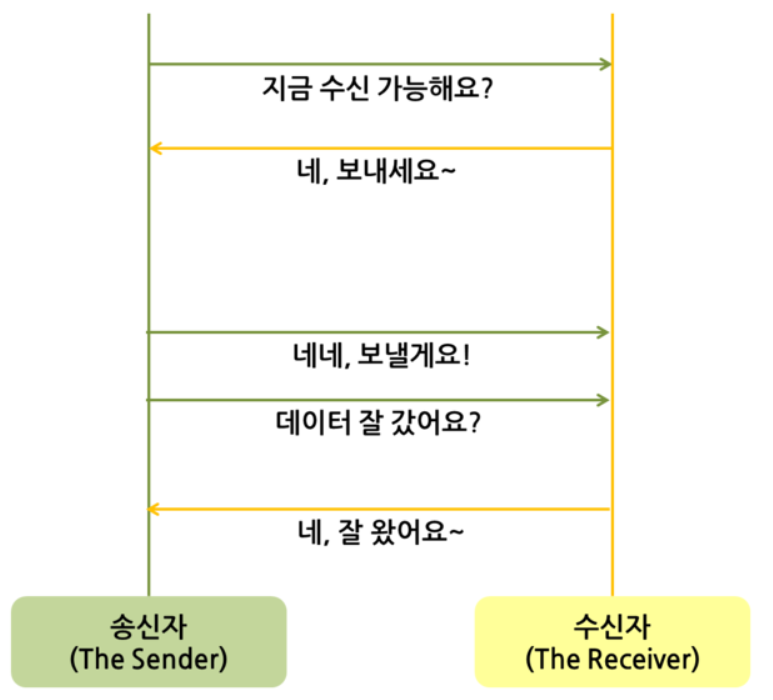

# 3. TCP

- Transmission Control Protocol
- TCP는 네트워크 계층 중 전송 계층에서 사용하는 프로토콜 중 하나로, 신뢰성을 보장하는 연결형 서비스
- 1:1 통신 방식. 연결 후 통신
- 인터넷 환경(http, http/2)에서 기본으로 사용
- 가상 회선 방식을 제공 -> 패킷 사이 순서 보장
  - 가상회선 패킷 교환 방식
    - 각 패킷에는 가상회선 식별자가 포함
    - 모든 패킷을 전송하면 가상회선이 해제되고 패킷들은 전송된 순서대로 도착하는 방식
- host간 신뢰성있는 데이터 전달과 흐름제어 및 혼잡제어를 제공
- 연속성보다 신뢰성 있는 전송이 중요할 때에 사용하는 프로토콜(ex. WEB 통신, 파일 전송)
- 연결의 설정(3-hand-shaking)과 해제(4-hand-shaking)
- 인터넷 상에서 데이터를 메세지의 형태(세그먼트 라는 블록 단위)로 보내기 위해 IP와 함께 사용하는 프로토콜
  - IP가 데이터의 배달을 처리한다면 TCP는 패킷을 추적 및 관리
- 전이중(Full-Duplex)
  - 전송이 양방향으로 동시에 일어날 수 있음
- 점대점(Point to Point) 방식
  - 각 연결이 정확히 2개의 종단점을 가지고 있음
- 멀티캐스팅이나 브로드캐스팅을 지원하지 않음
- UDP보다 속도가 느림