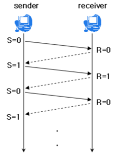
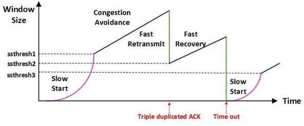

# 3. TCP 제어
## 1) 흐름제어 (endsystem 대 endsystem)
- 송신측과 수신측의 데이터 처리 속도 차이를 해결하기 위한 기법
- 이를 제어함으로써, 수신자가 데이터를 받는 데에 있어 오버플로우 발생을 방지
- Flow Control은 receiver가 packet을 지나치게 많이 받지 않도록 조절하는 것
- 기본 개념은 receiver가 sender에게 현재 자신의 상태를 feedback 한다는 점
- 송신하는 곳에서 감당이 안되게 많은 데이터를 빠르게 보내 수신하는 곳에서 문제가 일어나는 것을 막는다.

### Stop and Wait
매번 전송한 패킷에 대해 확인 응답을 받아야만 그 다음 패킷을 전송하는 방법

### Sliding Window (Go Back N ARQ)

수신측에서 설정한 윈도우 크기만큼 송신측에서 확인 응답없이 세그먼트를 전송할 수 있게 하여 데이터 흐름을 동적으로 조절하는 제어기법

전송은 되었지만, acked를 받지 못한 byte의 숫자를 파악하기 위해 사용하는 protocol

## 2) 혼잡제어
- 송신측의 데이터 전달과 네트워크의 데이터 처리 속도 차이를 해결하기 위한 기법
- 네트워크 내에서의 데이터 양을 제어함으로 통신의 혼잡/부하가 생기는 것을 방지

### AIMD(Additive Increase / Multiplicative Decrease)
- 처음에 패킷을 하나씩 보내고 이것이 문제없이 도착하면 window 크기(단위 시간 내에 보내는 패킷의 수)를 1씩 증가시켜가며 전송하는 방법
- 패킷 전송에 실패하거나 일정 시간을 넘으면 패킷의 보내는 속도를 절반으로 줄임
- 네트워크가 혼잡해지는 상황을 미리 감지하지 못함 즉, 네트워크가 혼잡해지고 나서야 대역폭을 줄이는 방식

### Slow Start (느린 시작)
- AIMD 방식이 네트워크의 수용량 주변에서는 효율적으로 작동하지만, 처음에 전송 속도를 올리는데 시간이 오래 걸리는 단점이 존재
- Slow Start 방식은 AIMD와 마찬가지로 패킷을 하나씩 보내면서 시작하고, 패킷이 문제없이 도착하면 각각의 ACK 패킷마다 window size를 1씩 늘림. 즉, 한 주기가 지나면 window size가 2배로 됨
- 처음에는 네트워크의 수용량을 예상할 수 있는 정보가 없지만, 한번 혼잡 현상이 발생하고 나면 네트워크의 수용량을 어느 정도 예상할 수 있음

### Fast Retransmit (빠른 재전송)
- 패킷을 받는 쪽에서 먼저 도착해야할 패킷이 도착하지 않고 다음 패킷이 도착한 경우에도 ACK 패킷을 보내게 됨
- 단, 순서대로 잘 도착한 마지막 패킷의 다음 패킷의 순번을 ACK 패킷에 실어서 보내게 되므로, 중간에 하나가 손실되게 되면 송신 측에서는 순번이 중복된 ACK 패킷을 받게 됨. 이것을 감지하는 순간 문제가 되는 순번의 패킷을 재전송 해줄 수 있음
- 중복된 순번의 패킷을 3개 받으면 재전송

### Fast Recovery (빠른 회복)
- 혼잡한 상태가 되면 window size를 1로 줄이지 않고 반으로 줄이고 선형증가시키는 방법
- 이 정책까지 적용하면 혼잡 상황을 한번 겪고 나서부터는 순수한 AIMD 방식으로 동작
