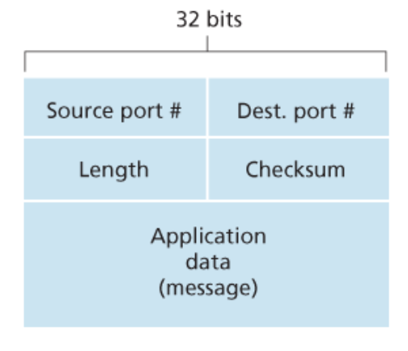

# 5. UDP
Connectionless Transport라고 불린다.

전송계층에 속해있으며, TCP와 달리 굉장히 단순하다. User Datagram Protocol을 줄여 UDP라고 부른다.

## 1) UDP
- 데이터 경계를 구분함 : 데이터그램(datagram) 서비스
- 비연결형 서비스
  - 비연결형, 즉 Connectionless한 특징을 가짐
  - TCP와 달리, 논리적인 경로를 수립할 필요가 없으므로 3-way handshaking 같은 절차가 존재하지 않음

- 흐름제어X, 혼잡제어X, 데이터 전송보장X, 순서 보장X
  - TCP에서 제공하는 Reliability와 관련된 기능을 제공하지 않음
  - Checksum을 활용하여 최소한의 오류만 검출
  - 때문에 TCP와 비교하여 빠른 속도와 적은부하를 가짐
  - 실시간 스트리밍, DNS 등에 사용 (신뢰성 < [속도, 성능] 인 경우에 사용)

- 점대점, 브로드캐스팅, 멀티캐스팅 
  - TCP와 달리, 점대점 통신뿐만 아니라 
    - 1:N 관계의 브로드캐스팅 방식
    - N:M 관계의 멀티캐스팅 방식
  - 모두 지원

- UDP에서 상대방이 데이터를 수신했는지 말았는지 여부는에서 중요하지 않음. (보냈다는 것만이 중요)
   - -> 신뢰도 낮지만 속도가 빠름

## 2) UDP Segment 구조 (UDP Header)

 - Source port : 시작 포트 
 - Destination port : 도착지 포트 
 - Length : 길이 
 - Checksum_ : 오류 검출 - 중복 검사의 한 형태로, 오류 정정을 통해 공간이나 시간 속에서 송신된 자료의 무결성을 보호하는 단순한 방법이다.

이렇게 간단하므로, TCP 보다 용량이 가볍고 송신 속도가 빠르게 작동됨.
그러나 확인 응답을 못하므로 TCP보다 신뢰도가 떨어짐.

 ## TCP와 UDP 비교
 

###  데이터그램 패킷 교환 방식
각 패킷이 독립적으로 이동하며 최적의 경로를 선택

하나의 메시지에서 분할된 여러 패킷은 서로 다른 경로로 전송될 수 있음
도착순서가 다를 수있는 방식

### 데이터경계 구분 비교 사진

---

# 정리

### UDP 통신이란?

- User Datagram Protocol의 약자로 데이터를 데이터그램 단위로 처리하는 프로토콜이다.
- 비연결형, 신뢰성 없는 전송 프로토콜이다.
- 데이터그램 단위로 쪼개면서 전송을 해야하기 때문에 전송 계층이다.
- Transport layer에서 사용하는 프로토콜.

### TCP와 UDP는 왜 나오게 됐는가?

1. IP의 역할은 Host to Host (장치 to 장치)만을 지원한다. 장치에서 장치로 이동은 IP로 해결되지만, 하나의 장비안에서 수많은 프로그램들이 통신을 할 경우에는 IP만으로는 한계가 있다.

2. 또한, IP에서 오류가 발생한다면 ICMP에서 알려준다. 하지만 ICMP는 알려주기만 할 뿐 대처를 못하기 때문에 IP보다 위에서 처리를 해줘야 한다.

- 1번을 해결하기 위하여 포트 번호가 나오게 됐고, 2번을 해결하기 위해 상위 프로토콜인 TCP와 UDP가 나오게 되었다.
- *ICMP : 인터넷 제어 메시지 프로토콜로 네트워크 컴퓨터 위에서 돌아가는 운영체제에서 오류 메시지를 전송받는데 주로 쓰임

### 그렇다면 TCP와 UDP가 어떻게 오류를 해결하는가?

- TCP : 데이터의 분실, 중복, 순서가 뒤바뀜 등을 자동으로 보정해줘서 송수신 데이터의 정확한 전달을 할 수 있도록 해준다.
- UDP : IP가 제공하는 정도의 수준만을 제공하는 간단한 IP 상위 계층의 프로토콜이다. TCP와는 다르게 에러가 날 수도 있고, 재전송이나 순서가 뒤바뀔 수도 있어서 이 경우, 어플리케이션에서 처리하는 번거로움이 존재한다.

### UDP는 왜 사용할까?

- UDP의 결정적인 장점은 데이터의 신속성이다. 데이터의 처리가 TCP보다 빠르다.
- 주로 실시간 방송과 온라인 게임에서 사용된다. 네트워크 환경이 안 좋을때, 끊기는 현상을 생각하면 된다.
 
### DNS(Domain Name System)에서 UDP를 사용하는 이유

- Request의 양이 작음 -> UDP Request에 담길 수 있다.
- 3 way handshaking으로 연결을 유지할 필요가 없다. (오버헤드 발생)
- Request에 대한 손실은 Application Layer에서 제어가 가능하다.
- DNS : port 53번
- But, TCP를 사용할 때가 있다! 크기가 512(UDP 제한)이 넘을 때, TCP를 사용해야한다.
