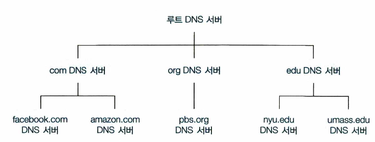
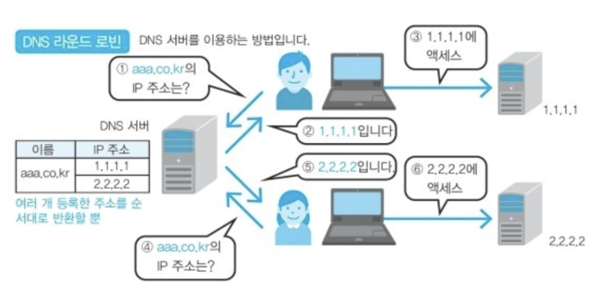

# 6. DNS
Domain Name System Servers

모든 통신은 IP를 기반으로 연결된다. 하지만 사람과 라우터는 서로 선호하는 식별자가 다르다. 이를 절충하기 위해서 호스트 이름을 IP 주소로 변환해줄 필요가 있는데, 이때 DNS를 이용한다.

때문에 DNS 가 등장 했으며 DNS 는 IP 주소와 도메인 주소를 매핑하는 역할을 수행한다.

DNS는 도메인 이름과 IP 주소를 저장하고 있는 분산 데이터베이스로, 웹사이트를 위한 주소록이라고 생각하면 된다.

숫자로 된 IP 주소(ex. 63.245.217.105) 대신 사용자가 사용하기 편리하도록 주소를 매핑(ex. www.naver.com)해주는 역할을 한다.

## 1) 분산 계층 데이터베이스
만약에 DNS 한 곳에 모든 질의를 한다면 간단하다. 하지만 중앙 집중 데이터베이스는 서버의 고장, 트래픽양, 먼 거리의 중앙 집중 데이터베이스, 유지관리 등의 문제를 고려하여 확장성이 없다는 것을 알 수 있다.

그래서 DNS는 많은 서버를 이용해 계층 형태로 분산시킨다.

세 가지 DNS 서버로 나뉜다.

### 루트 DNS 서버

1000개 이상의 루트 서버 인스턴스가 전세계에 흩어져 있다.
루트 네임 서버는 TLD 서버의 IP 주소들을 제공한다.

### 최상위 레벨 도메인 네임 (top-level domain, TLD) DNS 서버

com, org, net, edu, gov와 같은 상위 레벨 도메인과 kr, uk, fr와 같은 모든 국가의 상위 레벨 도메인에 대한 TLD 서버가 있다.
TLD 서버는 책임 DNS 서버에 대한 IP 주소를 제공한다.

### 책임 (authoritative) DNS 서버

조직의 자체 DNS 서버, 조직의 명명 된 호스트에 대한 IP 매핑에 권한있는 호스트 이름을 제공한다.

## 2) 도메인 주소가 IP로 변환되는 과정
1. 디바이스는 hosts 파일을 연다
- hosts 파일에는 로컬에서 직접 설정한 호스트 이름과 IP 주소를 매핑 하고 있음
2. DNS는 캐시를 확인
- 기존에 접속했던 사이트의 경우 캐시에 남아 있을 수 있음
- DNS는 브라우저 캐시, 로컬 캐시(OS 캐시), 라우터 캐시, ISP(Internet Service Provider)캐시 순으로 확인
3. DNS는 Root DNS에 요청을 보냄
- 모든 DNS에는 Root DNS의 주소가 포함되어 있음
- 이를 통해 Root DNS에게 질의를 보냄
- Root DNS는 도메인 주소의 최상위 계층을 확인하여 TLD(Top Level DNS)의 주소를 반환
4. DNS는 TLD에 요청을 보냄
- Root DNS로 부터 반환받은 주소를 통해 요청을 보냄
- TLD는 도메인에 권한이 있는 Authoritative DNS의 주소를 반환
5. DNS는 Authoritative DNS에 요청을 보냄
- 도메인 이름에 대한 IP 주소를 반환
- 이때 요청을 보내는 DNS의 경우 재귀적으로 요청을 보내기 때문에 DNS 리쿼서라 지칭 하고 요청을 받는 DNS를 `네임서버`라 지칭함

## 3) DNS round robin 방식

- DNS를 이용하여 부하분산을 이용
- DNS 서버에서 하나의 도메인명에 여러 개의 IP주소를 등록시켜두고 클라이언트로부터 요청이 있으면 등록되어 있는 IP 주소를 순서대로 반환하는 방식
- 반환되는 IP 주소가 바뀌므로 클라이언트의 행선지도 바뀌어 결과적으로 커넥션이 분배

## 4) DNS round robin 방식의 문제점

- 서버의 수 만큼 공인 IP 주소가 필요함
  - 부하 분산을 위해 서버의 대수를 늘리기 위해서는 그 만큼의 공인 IP 가 필요함

- 균등하게 분산되지 않음
  - 스마트폰 접속의 경우, 프록시 서버를 경유하는데, 프록시 서버에서는 변환 결과가 일정 시간 동안 캐싱됨. 같은 프록시 서버를 경유하는 접속은 항상 같은 서버로 접속

- 서버가 다운되어도 확인 불가
  - DNS 서버는 웹 서버의 부하나 접속 수 등의 상황에 따라 질의결과를 제아할 수 없음
  - 전혀 감지가 안되기 때문에 어떤 원인으로 다운되어도 검출하지 못하고 유저에게 제공

Round Robin 방식을 기반으로 단점을 해소하는 DNS 스케줄링 알고리즘이 존재한다.

- Weighted round robin (WRR)
  - 각각의 웹 서버에 가중치를 가미해서 분산 비율을 변경한다. 물론 가중치가 큰 서버일수록 빈번하게 선택되므로 처리능력이 높은 서버는 가중치를 높게 설정하는 것이 좋다.

- Least connection
  - 접속 클라이언트 수가 가장 적은 서버를 선택한다. 로드밸런서에서 실시간으로 connection 수를 관리하거나 각 서버에서 주기적으로 알려주는 것이 필요하다.
