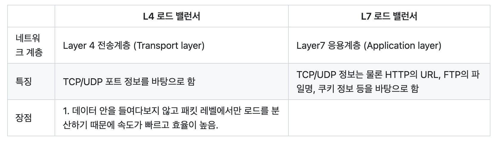

# 7. 네트워크 기기

## 네트워크 기기의 처리 범위
- 네트워크 기기는 계층별로 처리 범위를 나눌 수 있음
- 물리 계층을 처리할 수 있는 기기와 데이터 링크 계층을 처리할 수 있는 기기 등이 있음
- 상위 계층을 처리하는 기기는 하위 계층을 처리 할 수 있지만 그 반대는 불가
- L7 스위치는 애플리케이션 계층을 처리하는 기기로, 그 밑의 모든 계층의 프로토콜을 처리할 수 있지만 AP는 물리 계층 밖에 처리하지 못함.

> 애플리케이션 계층: L7 스위치
> 
> 인터넷 계층: 라우터, L3 스위치
> 
> 데이터 링크 계층: L2스위치, 브리지
> 
> 물리 계층: NIC(Network Interface Card), 리피터, AP

## 애플리케이션 계층을 처리하는 기기
### L7 스위치
- 스위치는 여 러장비를 연결하고 데이터 통신을 중재하며 목적지가 연결된 포트로만 전기 신호를 보내 데이터를 전송하는 통신 네트워크 장비

- 로드 밸런서라고도 하며, 서버의 부하를 분산하는 기기. 클라이언트로 부터 오는 여청들을 뒤쪽의 여러 서버로 나누는 역할을 하며 시스템이 처리할 수 있는 트래픽 증가를 목표로 함

- URL, 서버, 캐시, 쿠키들을 기반으로 트래픽을 분산함. 또한, 바이러스, 불필요한 외부 데이터 등을 걸러내는 필터링 기능 또한 가지고 있으며 응용 프로그램 수준의 트래픅 모니터링도 가능함

- 만약 장애가 발생한 서버가 있다면 이를 트래픽 분산 대상에서 제외해야 하는데, 이는 정기적으로 헬스 체크(health check)를 이용하여 감시하면서 이루어짐.

### L4스위치와 L7스위치 차이
- 로드밸런서로는 L7스위치뿐만 아니라 L4 스위치도 있음. 
- L4스위치는 전송 계층을 처리하는 기기로 스트리밍 관련 서비스에서는 사용할 수 없으며 메시지를 기반으로 인식하지 못하고 IP와 포트를 기반으로 트래픽을 분산
- L7 로드밸런서는 IP, 포트 외에도 URL, HTTP 헤더, 쿠키 등을 기반으로 트래픽 분산

## 인터넷 계층을 처리하는 기기

### 라우터
- 라우터(router)는 여러개의 네트워크를 연결, 분할, 구분시켜주는 역할을 하며 “다른 네트워크에 존재하는 장치끼리 서로 데이터를 주고받을 때 패킷 소모를 최소화하고 경로를 최적화하여 최소 경로로 패킷을 포워딩 하는 라우팅 장비.

> 라우팅 경로 결정 순서
> 
> - Longest Match Rule → AD → Metric

### L3스위치
- L3스위치란 L2스위치의 기능과 라우팅 기능을 갖춘 장비. L3스위치를 라우터라고 해도 무방
- 라우터는 소프트웨어 기반의 라우팅과 하드웨어 기반의 라우팅을 하는 것으로 나눠지고 하드웨러 기반의 라우팅을 담당하는 장치를 L3스위치라 함

## 데이터 링크 계층을 처리하는 기기
### L2스위치
- 장치들의 MAC주소를 MAC 주소 테이블을 통해 관리하며, 연결된 장치로 부터 패킷이 왔을 때 패킷 전송을 담당

- IP주소를 이해하지 못해 IP주소를 기반으로 라우팅은 불가능. 단순히 패킷의 MAC주소를 읽어 스위칭하는 역할을 함

- 목적지가 MAC주소 테이블에 없다면 전체 포트에 전달하고 MAC주소 테이블의 주소는 일정 시간 이후 삭제하는 기능도 있음

### 브리지
- 브리즈는 두 개의 근거리 통신망(LAN)을 상호 접속할 수 있도록 하는 통신망 연결 장치로, 포트와 포트 사이의 다리 역할을 하며 장치에 받아온 MAC주소를 MAC주소 테이블로 관리.

- 브리지는 통신망 범위를 확장하고 서로 다른 LAN등으로 이루어진 ‘하나의’ 통신망을 구축할 때 사용

## 물리 계층을 처리하는 기기
### NIC
- LAN카드라고 하는 네티워크 인터페이스 카드는 2대 이상의 컴퓨터 네트워크를 구성하는데 사용
- 네트워크와 빠른 속도로 데이터를 송수신 할 수 있도록 컴퓨터 내에 설치하는 확장 카드
- 각 LAN 카드에는 각각을 구분하기 위한 고유의 식별 번호인 MAC주소가 있음

### 리피터
- 리피터는 들어오는 약해진 시호 정도를 증촉하여 다른 쪽으로 전달 하는 장치. 이를 통해 패킷이 더 멀리 갈 수 있음. 하지만 이는 광케이블이 보급됨에 따라 현재는 잘 쓰이지 않음

### AP
- AP(Access Point)는 패킷을 복사하는 기기
- AP에 유선 LAN은 연결한 후 다른 장치에서 무선 LAN기술(와이파이 등)을 사용하여 무선 네트워크 연결을 할 수 있음.