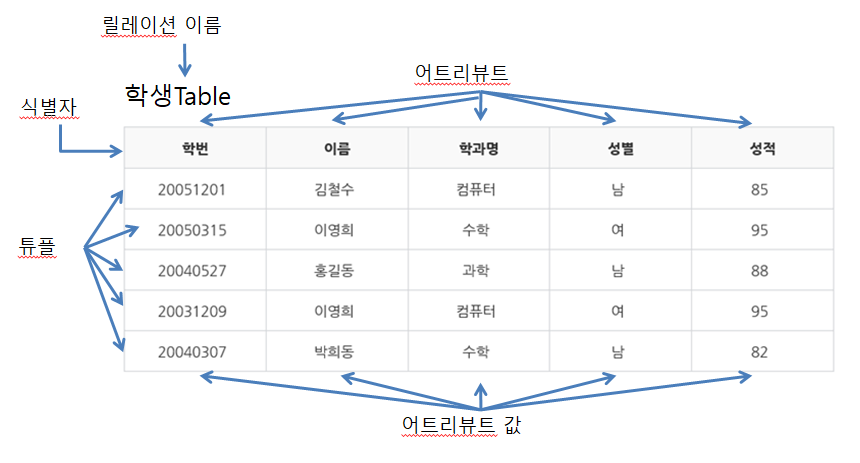

### [데이터베이스 기초]

#### 용어

1. **식별자(identifier)**
   엔티티를 대표할 수 있는 유일성을 만족하는 속성

   - 특징
   - 유일성 : 하나의 릴레이션에서 모든 행은 서로 다른 키 값을 가져야 함
   - 최소성 : 꼭 필요한 최소한의 속성들로만 키를 구성해야 함

2. **튜플(Tuple)= Record= Row**
   테이블에서의 행

   - 튜플은 릴레이션에서 같은 값을 가질 수 X
   - Cardinality= 튜플의 수

3. 개체(Entity)

   - 데이터로 표현하려고 하는 객체 (여러 속성들로 구성)
     ex) 학생, 과목

4. **속성(Attribute)=Column**
   테이블에서의 열

   - Degree= 속성의 수

5. 관계(Relation)
   - 개체와 개체 사이의 연관성
     ex) 학생과 과목 간의 “수강”이라는 관계를 가짐

---

#### 쿼리 문법

1. 데이터 정의 언어 (DDL)

   - 관계형 데이터베이스의 구조를 정의함
   - 쌍, 속성, 관계 인덱스 파일 위치 등 데이터베이스 고유의 특성을 포함함

2. 데이터 조작 언어 (DML)

   - 데이터베이스 검색, 등록, 삭제, 갱신을 하기 위해 사용하는 데이터베이스 언어
   - 데이터베이스의 검색 및 업데이트 등 데이터 조작을 위해 사용

3. 데이터 제어 언어 (DCL)
   - 데이터베이스에서 데이터에 대한 액세스를 제어하기 위한 데이터베이스 언어 또는 데이터베이스 언어 요소
   - 박탈, 연결, 권한 부여, 질의, 자료 삽입, 갱신, 삭제 등
