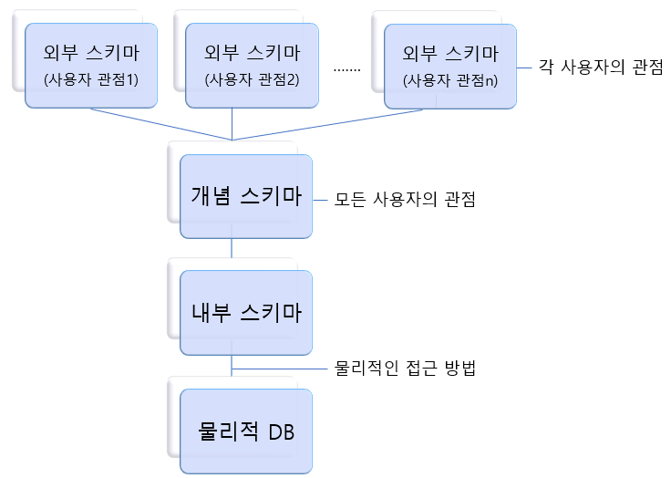

### [스키마(Schema)]

- 스키마는 DB의 구조와 제약 조건에 관한 전반적인 명세를 정의한 메타데이터의 집합

- 개체의 특성을 나타내는 속성(Attribute), 속성들의 집합으로 이루어진 개체(Entity), 개체 사이에 존재하는 관계(Relation)에 대한 정의와 이들이 유지해야 할 제약 조건을 정의함

* 메타데이터(meta data) : 데이터에 대한 데이터로, 어떤 목적을 가지고 만들어진 데이터

---

#### [스키마의 특징] "ACID"

- Atomicity(원자성) : 작업들이 하나의 원자단위로서 시행되는 것 (중간에 실패하는 일 X)
- Consistency(일관성) : 언제나 일관된 DB상태 유지
- Isolation(독립성) : 트랜잭션 시에 다른 연산작업이 끼어들지 못하게 함
- Durability(지속성) : 영원히 유지됨.

---

#### [스키마 3계층]

스키마는 사용자의 관점에 따라 외부 스키마, 개념스키마, 내부 스키마로 나눠집니다.

##### 외부 스키마 (External Schema) = 사용자 뷰(View)

- **개별 사용자들의 입장**에서 데이터 베이스의 **논리적** 구조
- 동일한 데이터에 대해 서로 다른 관점을 정의할 수 있도록 허용함
- 하나의 데이터베이스 시스템에 여러개의 외부 스키마 존재 가능
- 하나의 외부 스키마를 여러개의 응용 프로그램이나 사용자가 공용할 수 있음

##### 개념 스키마 (Conceptual Schema) = 전체적인 뷰(View)

- 데이터베이스의 **전체** 조직에 대한 논리적인 구조 **(기관/조직체 관점)**
- 각 데이터베이스에는 **한 개**의 개념 스키마만 존재
- 개체 간의 관계 및 무결성 제약 조건에 대한 명세를 정의
- 데이터베이스 파일에 저장되는 데이터의 형태를 나타냄
- 데이터베이스 관리자 (DBA)에 의해 구성됨

* 무결성 제약 조건 : 데이터베이스의 정확성, 일관성을 보장하기 위해 저장, 삭제, 수정 등을 제약하기 위한 조건

##### 내부 스키마 (Internal Schema) = 저장 스키마(Storage Schema)

- **물리적 저장장치**의 입장에서 본 데이터베이스 구조
- 개념 스키마를 디스크 기억장치에 물리적으로 구현하기 위한 방법을 기술한 것
- 저장될 데이터 항목의 내부 레코드 형식, 물리적 순서 등을 나타냄

---

#### [데이터 독립성]

- 데이터베이스 내의 데이터, 데이터를 사용하는 사용자 및 응용 프로그램, 데이터베이스의 저장 구조가 서로 영향을 받지 않는 성질

##### 논리적 독립성

- 개념 스키마가 변경되어도, 외부 스키마에 영향 X
   

##### 물리적 독립성

- 내부 스키마가 변경되어도, 개념/외부 스키마에 영향 X
- EX) 저장 구조 등이 물리적으로 변경되어도 다른 스키마와 독립적임
