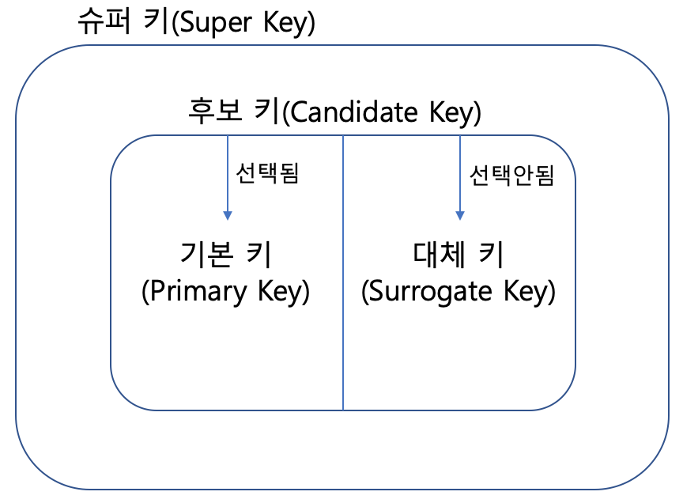
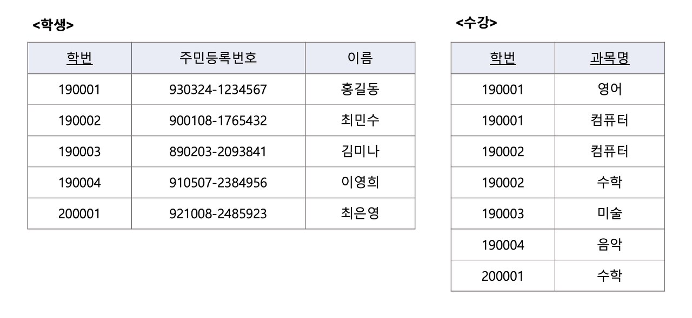

### [키(Key)]

- 데이터베이스에서 조건에 만족하는 튜플을 찾거나 순서대로 정렬할 때 튜플들을 서로 구분할 수 있는 기준이 되는 속성

#### [키(Key)의 특징]

> Key의 종류에 따라 만족하는 특징이 다름

- 유일성 : 유일한 값을 가져야 함
- 최소성 : 최소한의 값으로 개체를 식별할 수 있어야 함
- 불변성 : 변하는 값이어선 안됨

#### [키(Key)의 종류]

##### 후보키(Candidate Key)

- **유일성 O, 최소성 X**
- 릴레이션을 구성하는 속성들 중에서 튜플을 유일하게 식별하기 위해 사용하는 속성들의 부분집합
- 기본키로 사용할 수 있는 속성

- 하나의 릴레이션내에서는 중복된 튜플들이 있을 수 없으므로 모든 릴레이션에는 반드시 하나 이상의 후보키가 존재함

EX) <학생> 릴레이션: 학번, 주민등록번호 -> 후보키
<수강> 릴레이션에: [학번, 과목명] -> 후보키 (유일성과 최소성 만족)

##### 기본키(Primary Key)

- 유일성 O, 최소성 O
- 후보키 중에서 선택한 Main Key
- 한 릴레이션에서 특정 튜플을 유일하게 구별할 수 있는 속성
- **Null값 X**
- **중복값 X**

EX) <학생> 릴레이션: 후보키인 학번/ 주민등록번호 -> 기본키
<수강> 릴레이션에서는 [학번, 과목명] -> 기본키

##### 대체키(Alternate Key) = 보조키

- 후보키가 둘 이상일 때 기본키를 제외한 나머지 후보키

##### 슈퍼키(Super Key)

- **유일성 O, 최소성 X**
- 한 릴레이션 내에 있는 속성들의 집합으로 구성된 키
- **유일성**을 만족하므로 릴레이션을 구성하는 모든 튜플들 중 슈퍼키로 구성된 속성의 집합과 동일한 값을 나타내지 X

EX) 학번 + 주민번호를 사용하여 슈퍼키를 만들면 - 다른 튜플들과 구분할 수 있는 유일성은 만족 - 학번이나 주민번호 하나만 가지고도 다른 튜플들을 구분할 수 있으므로 최소성은 만족 X

##### 외래키(Foregin Key)

- 다른 릴레이션의 기본키를 참조하는 속성 또는 속성들의 집합
- 릴레이션 간의 관계를 표현
- 참조 릴레이션의 기본키와 동일한 키 속성을 가짐

EX) <수강> 릴레이션의 학번은 <학생> 릴레이션의 **기본키인 학번**을 참조 -> <수강> 릴레이션에서 **학번은 외래키**

##### 외래키의 필요성

> 데이터 무결성: 데이터가 항상 정확한 값을 유지하는 성질

EX) 학생 릴레이션의 학번이 변경-> 수강 릴레이션의 학번 값이 변경 X -> 무결성이 깨짐
