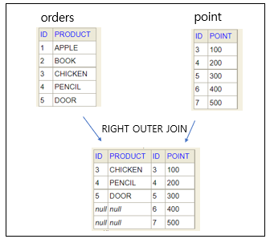

### [조인(Join)]

- 여러 테이블에 흩어져 있는 정보 중 사용자가 필요한 정보만 가져와서 가상의 테이블처럼 만들고 결과를 보여주는 것
- 조회 테이블이 너무 많이 쪼개져 있으면 느리기 때문에 입력, 수정, 삭제의 성능 향상을 위해 사용

#### [조인의 종류]

##### Inner JOIN

- 두 테이블 간 JOIN 조건을 만족하는 행을 구하는 것 (교집합)

EX) 

##### Outer JOIN

- INNER JOIN과 달리, 동일한 조건이 없는 행도 구하는 것

1. LEFT OUTER JOIN
   

   - A, B 테이블간 조인 조건이 맞지 않는 A와 B 테이블 중 A 테이블은 무조건 결과값에 포함
   - B의 값이 없는 경우: 해당 속성 NULL로 반환

   EX) 

2. RIGHT OUTER JOIN
   

   - A 와 B 테이블 중 B 테이블은 무조건 결과값에 포함
   - A의 값이 없는 경우: 해당 속성 NULL로 반환

   EX) 

3. FULL OUTER JOIN
   
   - 좌측과 우측의 모든 데이터를 읽어 JOIN

##### CROSS JOIN = CARTESIAN PRODUCT

- 한쪽 테이블의 모든 행과 다른 쪽 테이블의 모든 행을 JOIN 하는 것
- 상호 조인 결과의 전체 행 개수: 두 테이블의 각 행의 개수를 곱한 값

##### Natural JOIN

- Inner JOIN의 하위 개념으로 동일한 이름을 갖는 모든 칼럼에 대해 JOIN
- 제약조건
  - JOIN 되는 테이블의 데이터 도메인과 칼럼명의 칼럼 값이 동일해야 함
  - 칼럼 값이 같지 않으면 결과가 출력 X

EX) 

- 동일한 이름의 칼럼: ID
- ID의 도메인이 INT로 모두 같으므로 NATURAL JOIN 가능

##### Self JOIN

- 자기 자신의 테이블을 JOIN하는 것
