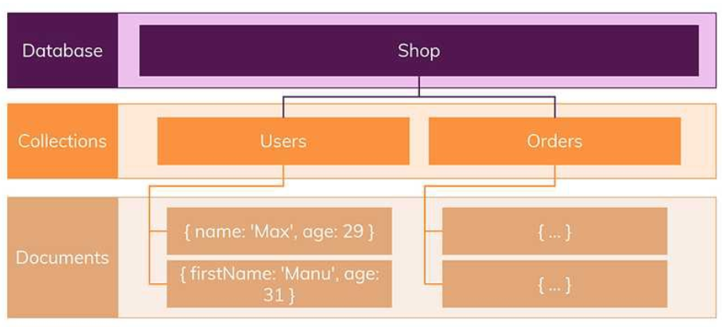
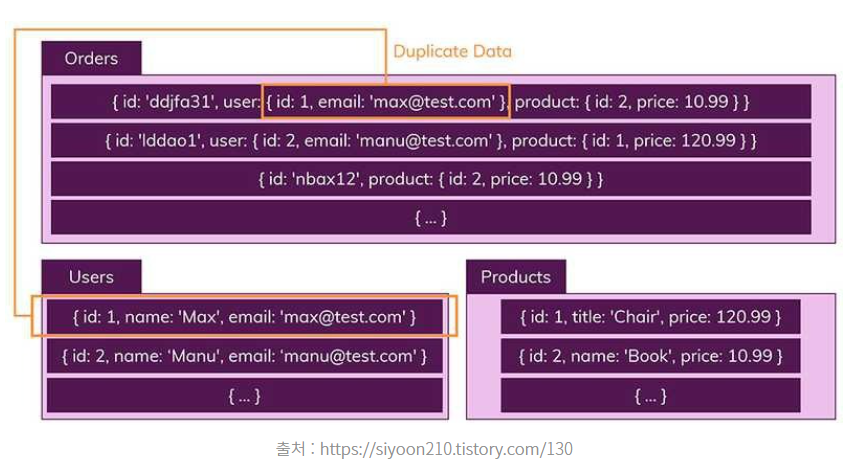
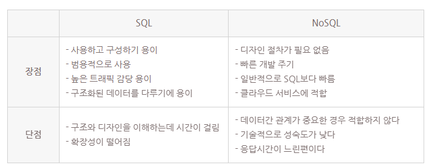
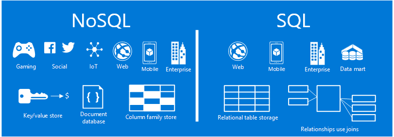

### [No SQL]

#### [SQL VS No SQL]

##### SQL

Structured Query Language의 줄임말로, 관계형데이터베이스시스템(RDBMS)에서 데이터를 관리할 때 사용한다.

관계형 데이터 베이스의 특징은 아래와 같다.

1. 엄격한 스키마(schema)
   

SQL은 고정된 행(row)과 열(coulm)로 구성된 테이블에 데이터를 저장한다.
각 열은 하나의 속성에 대한 정보를 저장하고, 행에는 각 열의 데이터 형식에 맞는 데이터가 저장된다.
테이블의 구조 및 데이터 형식은 사전에 정의되며, 해당 형식에 맞는 데이터만 삽입할 수 있는 엄격한 구조이다.

상품 정보가 들어있는 Products 테이블을 보면 Id, Name, Price, Seller, Category라는 Column이 미리 정해져있고, 해당 필드에는 적합한 포맷의 데이터만 넣을 수 있다.

2. 테이블 간의 관계
   

데이터들을 여러 개의 테이블에 나누기 때문에, 테이블 간 데이터가 중복되지 않는다. 아래와 같이 상품정보 / 고객정보 / 주문정보를 나누어 저장하여 데이터를 관리하기 때문에 수정이 필요할 때에는 해당 테이블만 수정하면 되어, 다른 테이블에서 부정확한 데이터를 다룰 위험이 없다.

여러 테이블의 데이터를 조합해서 사용해야 하는 경우, 테이블을 JOIN하면 된다.
예를 들어, 주문 id 145의 상품 가격을 알고 싶다면 orders 테이블과 products 테이블을 join 하면 된다.

장점
– 스키마가 엄격하기 때문에, 데이터는 일관되어 있고 무결하다.
– 테이블 간 중복 없이 데이터가 저장되기 때문에, 데이터 수정 시 용이하다.

단점
– 엄격한 스키마로 유연성이 떨어진다
– 중복된 데이터가 없기 때문에, JOIN을 사용하여 복잡한 쿼리를 짜야 한다.

SQL은 아래 환경에 적합하다.

- 사전에 파악 가능한 논리적이고 뚜렷한 요구 사항이 있는 관계형 데이터를 처리할 때(변경될 여지가 없고, 사용자에게 명확한 데이터가 중요한 경우)
- 앱과 데이터베이스 간에 동기화된 상태로 유지해야 하는 스키마
- 복잡한 쿼리 또는 다중 행 트랜잭션이 필요한 앱

#### [No SQL]

- “Not only SQL”의 의미로, 관계형 데이터베이스 외에도 다양한 방식으로 데이터를 저장하는 비관계형 데이터베이스의 프로그래밍 언어이다.

NoSQL의 특징은 SQL의 반대라고 보면 된다.

1. 스키마 없음
   

SQL처럼 미리 row, column 및 데이터 형식을 미리 정해놓지 않는다.

SQL에서는 정해진 스키마를 따르지 않는다면 데이터를 추가할 수 없지만, NoSQL에서는 다른 구조의 데이터를 같은 컬렉션(=SQL의 테이블)에 추가할 수 있다.

출처 : https://siyoon210.tistory.com/130

Users 컬렉션을 보면 {name: ‘Max’, age: 29}로 저장된 문서와 {firstName: ‘Manu’, age: 31}로 서론 다른 데이터가 저장되어 있는 것을 볼 수 있다.

2. 관계 없음
   

NoSQL은 SQL처럼 여러 테이블에 데이터를 나눠담는 게 아니라, 관련된 일반적인 정보를 모두 포함한 데이터를 컬렉션에 저장한다. (데이터 중복 허용)

따라서 여러 테이블/컬렉션을 JOIN할 필요없이 이미 필요한 데이터를 갖춘 문서를 갖는다.

장점
– 스키마가 없기 때문에, 유연하다.
– 애플리케이션이 필요로 하는 형식으로 데이터가 저장되기 때문에, 데이터 처리 속도가 빠르다.

단점
– 데이터가 중복될 수 있기 때문에 수정이 필요한 경우 여러 레코드를 업데이트해야 한다.

NoSQL은 아래 환경에 적합하다.

- 대규모 데이터, 확정되지 않은 데이터 또는 빠르게 변화하는 데이터를 다룰 때
- 스키마 중립적 데이터 또는 앱에 의해 결정되는 스키마
- 강력한 일관성, 데이터 무결성보다는 성능과 가용성이 더 중요할 때

NoSQL(Not Only SQL) 💾

위에서 설명한 RDBMS가 아닌, 다른 형태의 데이터 저장 기술을 의미한다.

RDBMS와는 달리 테이블 간 관계를 정의하지 않는다!
데이터 테이블은 그냥 하나의 테이블일 뿐이다.
테이블 간의 관계를 정의하지 않아 일반적으로 테이블 간 Join도 불가능하다.
예시
MongoDB, Redis 등

🚀 사용 목적
빅데이터가 등장하면서, 점점 데이터와 트래픽이 기하급수적으로 증가하는 상황에서 고안되었다.

👍 장점
유연성

스키마가 없어 유연하고 자유로운 데이터 구조를 가질 수 있다. 언제든 저장된 데이터를 조정하고 새로운 필드를 추가할 수 있다.
데이터 분산이 용이하다. 수평적 확장(Scale-Out : 서버 개수를 늘림)을 쉽게 할 수 있다. 따라서 비용이 적게 든다.
👎 단점
데이터 일관성이 지켜지지 않는다.

데이터 중복이 발생하고, 해당 데이터가 변경될시 모든 컬렉션에서 수정해야 한다.
스키마가 없으니 명확한 데이터 구조를 보장하지 않는다. 데이터 구조 결정 자체가 어렵다.
🧷 종류

Key-Value Database
Redis, Riak, Amazon Dynamo DB 등이 있다.
데이터가 Key와 Value의 쌍으로 저장된다.

Key는 Value에 접근하기 위한 용도로 사용되며, 값은 어떠한 형태의 데이터라도 담을 수 있다. 심지어는 이미지나 비디오도 가능하다.
검색에 최적화되어 있다. 질의의 속도가 매우 빠르다.
Document Database
MongoDB, CouchDB 등이 있다.
데이터가 Key와 Document의 형태로 저장된다.

Key-Value 모델과 달리 Value가 계층적인 형태인 Document로 저장된다. 객체지향에서의 객체와 유사하며, 이들은 하나의 단위로 취급되어 저장된다. 즉, 하나의 객체를 여러 개의
테이블에 나눠 저장할 필요가 없어진다.
객체-관계 매핑이 필요하지 않다. 객체를 Document의 형태로 바로 저장 가능하기 때문이다.
검색에 최적화되어 있다. Key-Value 모델의 특징과 동일하다.
단점

사용이 번거롭고 쿼리가 SQL과는 다르다.
도큐먼트 모델에서는 질의의 결과가 JSON이나 xml 형태로 출력되기 때문에 그 사용 방법이 RDBMS에서의 질의 결과를 사용하는 방법과 다르다.
Wide Column Database
HBase, Hypertable 등이 있다.
Column-family Model 기반의 Database.

특이하게도 이 모델은 키에서 필드를 결정한다.
키는 Row(키 값)와 Column-family, Column-name을 가진다. 연관된 데이터들은 같은 Column-family 안에 속해 있으며, 각자의 Column-name을 가진다.
관계형 모델로 설명하자면 속성이 계층적인 구조를 가지고 있는 셈이다.
저장된 데이터는 하나의 커다란 테이블로 표현이 가능하며, 질의는 Row, Column-family, Column-name을 통해 수행된다.
Graph Database
Neo4J 등이 있다.
데이터를 Node와 Edge, Property와 함께 그래프 구조를 사용하여 데이터를 표현하고 저장하는 Database.

개체와 관계를 그래프 형태로 표현한 것이므로 관계형 모델이라고 할 수 있다.
데이터 간의 관계가 탐색의 키일 경우에 적합하다.
페이스북이나 트위터 같은 소셜 네트워크에서(내 친구의 친구를 찾는 질의 등) 적합하고, 연관된 데이터를 추천해주는 추천 엔진이나 패턴 인식 등의 데이터베이스로도 적합하다.

[비교]

💾 RDBMS
데이터 구조가 명확하며 변경 될 여지가 없으며 명확한 스키마가 중요한 경우 사용하는 것이 좋다.
또한 중복된 데이터가 없어(데이터 무결성) 변경이 용이하기 때문에 관계를 맺고 있는 데이터가 자주 변경이 이루어지는 시스템에 적합하다.
💾 NoSQL
정확한 데이터 구조를 알 수 없고 데이터가 변경/확장이 될 수 있는 경우에 사용하는 것이 좋다.
수정이 별로 없는 시스템이 좋다. 데이터 중복이 발생할 수 있으며 중복된 데이터가 변경될 시에는 모든 컬렉션에서 수정을 해야 하기 때문이다.
Scale-out이 가능하므로 막대한 데이터를 저장해야 하는 시스템에 적합하다.
