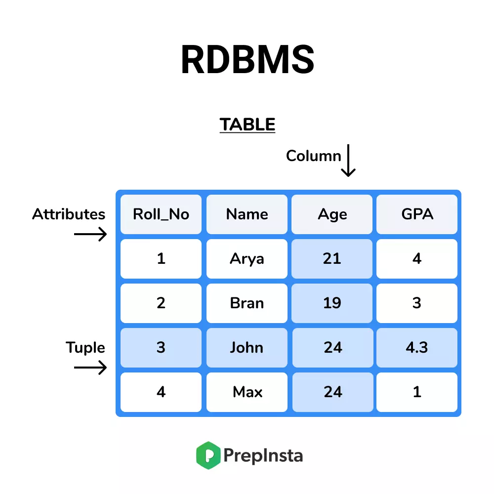
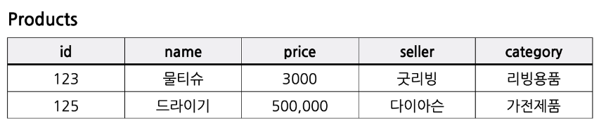

### [RDBMS (Relational DataBase Management System)]

- R+ DBMS : 관계형 데이터베이스 관리 시스템
- 테이블이 다른 테이블들과 관계를 맺고 모여있는 집합체
- **SQL(Structured Query Language)**에 의해 관리

- EX) MySQL, PostgreSQL 등

#### [특징]

1. 엄격한 스키마(schema)
   

- SQL은 고정된 행(row)과 열(coulm)로 구성된 테이블에 데이터 저장
- 각 열은 하나의 속성에 대한 정보를 저장, 행에는 각 열의 데이터 형식에 맞는 데이터가 저장
- 테이블의 구조 및 데이터 형식은 사전에 정의되며, 해당 형식에 맞는 데이터만 삽입할 수 있는 **엄격한** 구조

2. 테이블 간의 관계
   

- 데이터들을 여러 개의 테이블에 나누기 때문에, 테이블 간 데이터가 중복되지 않음
- 정보를 나누어 저장하여 데이터를 관리 -> 수정 용이
- 여러 테이블의 데이터를 조합해서 사용해야 하는 경우, 테이블 JOIN 사용

#### [장점]

- 데이터 일관성
- 정해진 스키마에 따라 데이터를 저장하므로 명확한 데이터 구조를 보장
- 각 데이터를 중복없이 한 번만 저장 -> 수정 용이

#### [단점]

- 중복된 데이터가 없기 때문에, JOIN을 사용하여 복잡한 쿼리를 짜야 함
- 성능을 향상을 위해 서버가 좋아야 함
- 엄격한 스키마 -> 유연한 데이터 관리 X
- 스키마를 변경할 경우 데이터 관리가 복잡해짐
