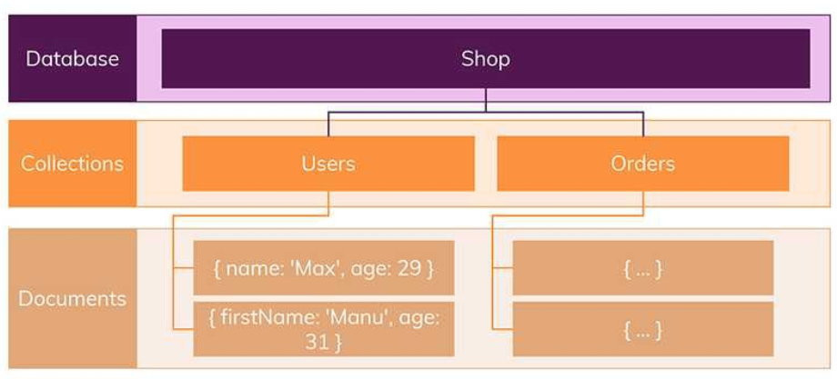
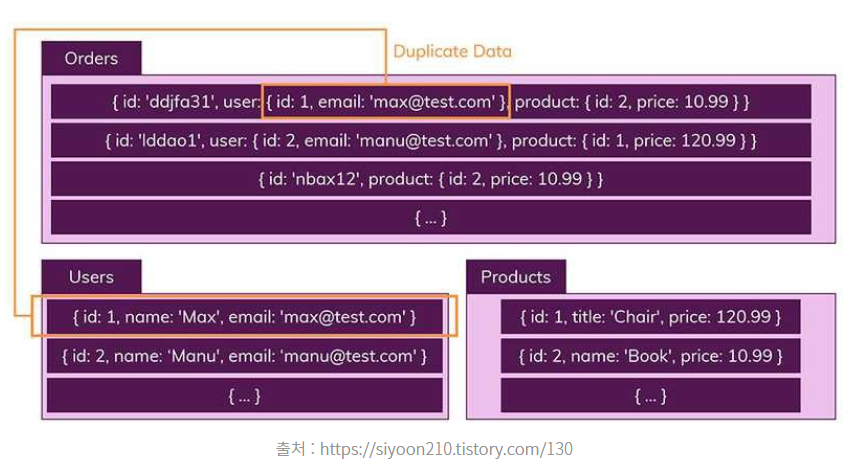
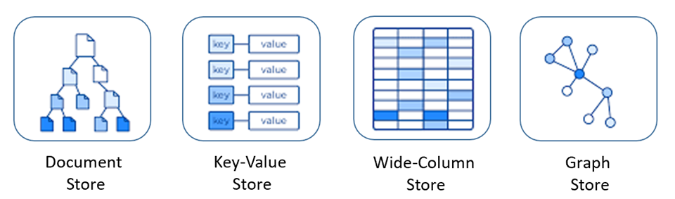
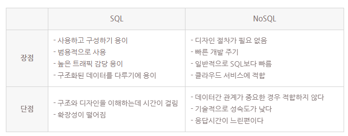
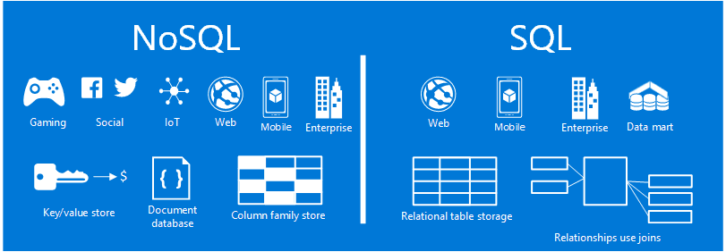

### [No SQL(Not only SQL)]

- 관계형 데이터베이스 외에도 다양한 방식으로 데이터를 저장하는 비관계형 데이터베이스의 프로그래밍 언어
- 등장 배경

  - 빅데이터가 등장하면서, 데이터와 트래픽이 기하급수적으로 증가함에 따라 필요해짐

- EX) MongoDB, Redis

#### [특징]

1. 스키마 없음
   

- SQL처럼 미리 행, 열 및 데이터 형식 정하지 X
- **다른 구조**의 데이터를 **같은 컬렉션**(=SQL의 테이블)에 추가할 수 있음

2. 관계 없음
   

- SQL처럼 여러 테이블에 데이터를 나눠담는 게 아니라, 관련된 일반적인 정보를 모두 포함한 데이터를 컬렉션에 저장 (데이터 중복 허용)
- JOIN 불필요

#### [종류]

1. **Key-Value Database**

- 데이터가 Key와 Value의 쌍으로 저장
- EX) Redis, Riak, Amazon Dynamo DB 등

- Key: Value에 접근하기 위한 용도로 사용되며
- Value: 어떠한 형태의 데이터라도 담을 수 있음 (이미지/ 비디오)

- 검색에 최적화
- 질의의 속도가 매우 빠름

2. **Document Database**

- 데이터가 Key와 Document의 형태로 저장
- EX) MongoDB, CouchDB 등

- Key-Value 모델과 달리 Value가 계층적인 형태인 Document 단위로 저장됨 (객체와 유사)
- 객체-관계 매핑 불필요
- 검색에 최적화

3. **Wide Column Database**

- Column-family Model 기반의 Database
- EX) HBase, Hypertable 등

- 특이하게 키에서 필드 결정
- 키는 Row(키 값)와 Column-family, Column-name을 가짐
- 연관된 데이터들은 같은 Column-family 안에 속하며, 각자의 Column-name을 가짐
- 저장된 데이터는 하나의 커다란 테이블로 표현
- 질의는 Row, Column-family, Column-name을 통해 수행됨

4. **Graph Database**

- 데이터를 Node와 Edge, Property와 함께 그래프 구조를 사용하여 데이터를 표현하고 저장하는 Database
- EX) Neo4J 등

- 개체와 관계를 그래프 형태로 표현한 것이므로 관계형 모델
- 데이터 간의 관계가 탐색의 키일 경우에 적합
- 연관된 데이터를 추천해주는 추천 엔진이나 패턴 인식 등의 데이터베이스로 적합

#### [장점]

- 스키마 X -> 유연한 데이터 구조
- 애플리케이션이 필요로 하는 형식으로 데이터가 저장 -> 데이터 처리 속도가 빠름
- 데이터 분산이 용이 -> 수평적 확장 (Scale-Out: 서버 개수 늘리는 것)을 쉽게 할 수 있음

#### [단점]

- 데이터 일관성 X
  – 데이터가 중복 -> 수정이 필요한 경우 여러 레코드를 업데이트해야 함
- 데이터 구조를 결정하기 어려움

[SQL VS No SQL]

[사용 목적]

1. RDBMS

- 데이터 구조가 명확하며 변경 될 여지가 없으며 명확한 스키마가 중요한 경우
- 중복된 데이터가 없어 변경이 용이하기 때문에 관계를 맺고 있는 데이터가 자주 변경이 이루어지는 시스템

2. NoSQL

- 정확한 데이터 구조를 알 수 없고 데이터가 변경/확장이 될 수 있는 경에 사용하는 것이 좋다.
- 수정이 거의 없는 시스템
- Scale-out이 가능하므로 막대한 양의 데이터를 저장해야 하는 시스템에 적합하다.
