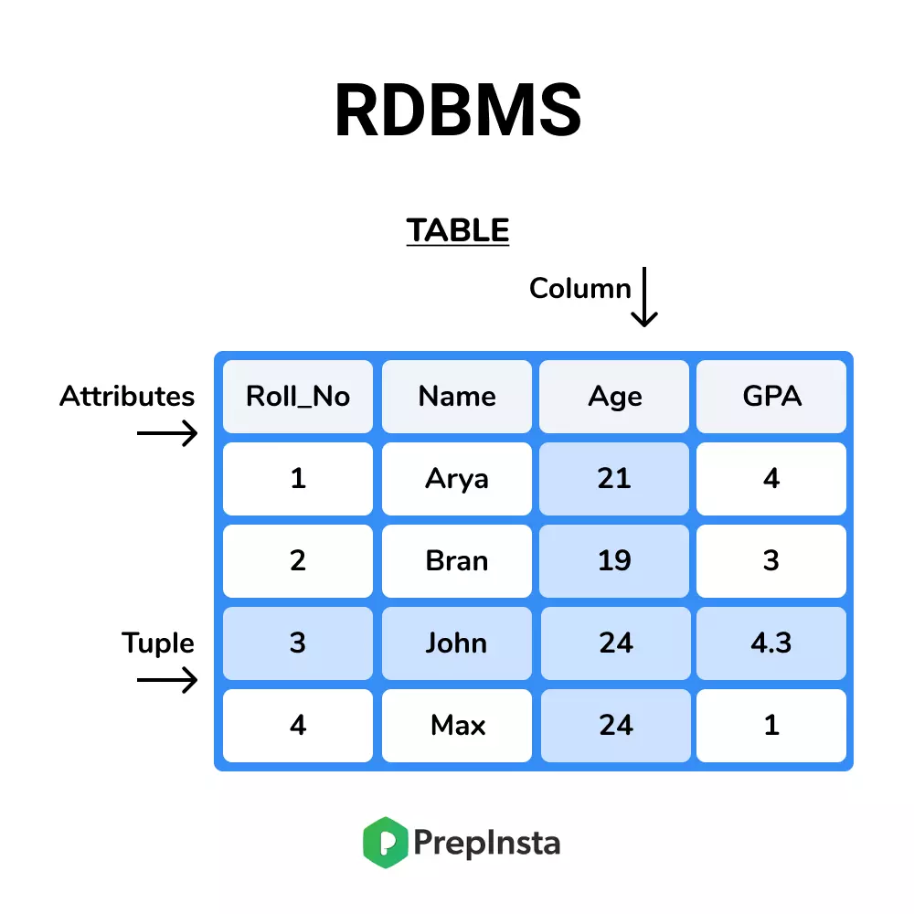

### [RDBMS (Relational DataBase Management System)]

- R+ DBMS : 관계형 데이터베이스 관리 시스템

SQL에 의해 저장되고 있으며 정해진 스키마에 따라 데이터를 저장해야 한다.

테이블이 다른 테이블들과 관계를 맺고 모여있는 집합체로 이해할 수 있다.
이러한 관계를 나타내기 위해 외래 키(foreign key)라는 것을 사용한다.
외래 키를 이용한 테이블 간 Join이 가능하다.
예시
MySQL, PostgreSQL 등

👍 장점
데이터 일관성을 지킬 수 있다!

정해진 스키마에 따라 데이터를 저장하여야 하므로 명확한 데이터 구조를 보장하고 있다.
각 데이터를 중복없이 한 번만 저장할 수 있다.
👎 단점
시스템이 커질 경우 JOIN문이 많은 복잡한 쿼리가 만들어질 수 있다.
성능을 향상시키기 위해서는 장비가 좋아야 한다. (Scale-Up : 서버 그 자체를 업그레이드 함) 비용이 기하급수적으로 증가한다.
스키마 때문에 유연한 데이터 관리가 어렵다. 스키마가 변경될 시 번거롭다.
