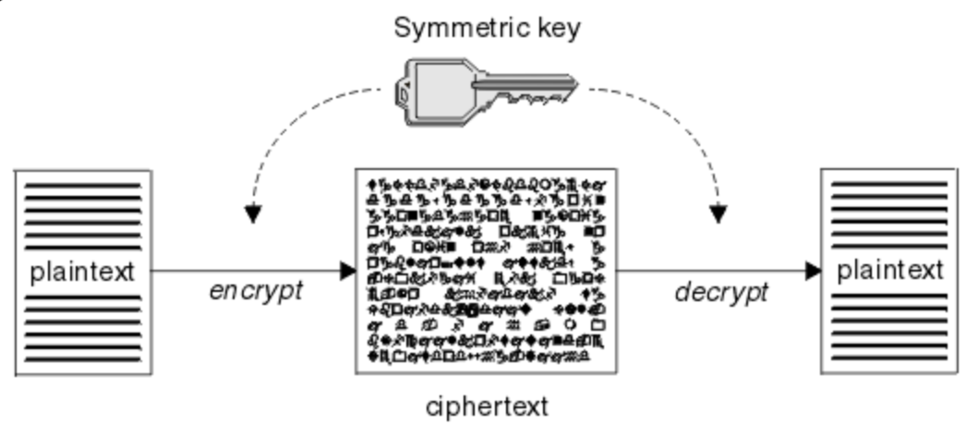

### [대칭키 & 공개키]

### [대칭키]

- 암호화와 복호화에 **같은** 암호키를 사용하는 암호화 방식
- **장점**
  - 공개키에 비해 암호화 및 복호화가 빠름
- **단점**
  - 암호화 통신을 하는 사용자끼리 같은 대칭키를 공유해야함
  - 사용자가 증가할수록 관리할 키가 많아짐
- 해결 방법
  - 키의 사전 공유
  - 키 배포 센터 사용
  - Diffie-Hellman키 교환
  - 공개키 암호화 방식

\*\* 대칭키를 전달하는 과정에서 해킹의 위험이 있음
 

- 대표 알고리즘: DES, 3DES, AES, SEED, ARIA

---

### [공개키]

- 암호화와 복호화에 사용하는 암호키가 서로 **다른** 암호화 방식
  - 송신자: 수신자의 공개키를 이용하여 메시지를 암호화
  - 수신자: 자신만이 갖고 있는 개인키를 이용해 복호화
- 장점: 공개키로 암호화한 메시지는 수신자의 개인키로만 해독할 수 있으므로 안전하게 메시지가 전달됨
- 단점: 암복호화가 복잡하고 느림
- 대표 알고리즘: Diffie-Hellman, RSA, DSA, ECC

---

### [기밀성, 무결성, 인증, 부인방지]

- 대칭키 알고리즘: 기밀성 제공
- 공개키 알고리즘: 기밀성, 인증, 부인방지 제공
   

- 무결성 보장 -> 전자서명(인증서) 추가
   

\*\* 기밀성(Confidentiality): 인가되지 않은 자는 정보를 확인하지 못하도록 하며, 정보가 유출되더라도 평문으로 해독할 수 없고 변조 또는 위조하지 못하도록 기밀을 유지
 

\*\* 무결성(Integrity): 인가 되지 않은 자로 부터 위조 또는 변조가 발생하지 않았는지 확인
 

\*\* 인증(Authentication): 수신 받은 메시지가 송신자 본인이라는 것을 확인, 증명
 

\*\* 부인 방지(Non-repudiation): 메시지를 보낸 사람이 보낸 사실을 부인하거나, 받은 사람이 받은 사실을 부인할 경우 증명

---

### [대칭키 VS 공개키]

