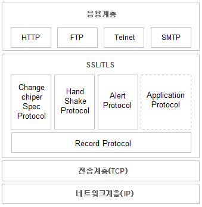
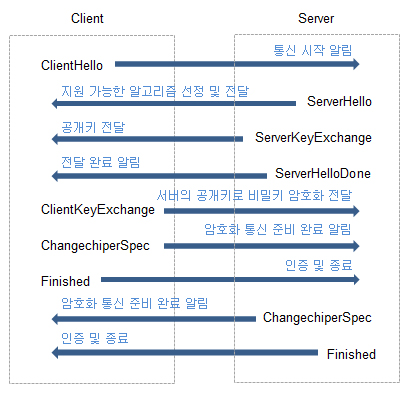

### [SSL(TLS)]

- TLS(Transport Layer Security)는 SSL(Secure Sockets Layer)가 표준화 되면서 바뀐 이름
- 인터넷과 같이 TCP/IP 네트워크를 사용하는 통신에 적용
- 통신 과정에서 전송 계층 종단간 보안과 데이터 무결성 보장

### [SSL(TLS) Handshake]

- 클라이언트와 서버 간에 통신을 하기 위한 상호 인증 과정 -> 클라이언트는 서버를 신뢰할 수 있는지를 판단 후 안전하게 연결 가능
- HTTPS 웹에 첫 연결 시 진행됨
- 일반적으로 RSA 알고리즘 사용

- OSI 7계층 모델의 어느 한 계층에 속해서 동작하는 것이 아니라, 응용 계층과 전송 계층 사이에 독립적인 프로토콜 계층을 만들어서 동작
- 응용 계층의 프로토콜 -> 외부로 보내는 데이터를 TCP가 아닌 SSL에 전송 -> SSL은 받은 데이터를 암호화하여 TCP에 보냄 -> 외부 인터넷으로 전달

- Handshake Protocol
  - 대부분의 메시지가 handshake protocol에 해당
  - 암호 알고리즘 결정, 키분배, 서버 및 클라이언트 인증을 수행하기 위해 사용되는 프로토콜

### [SSL 통신과정] \* 10장의 HTTPS 통신 흐름과 동일

1. 클라이언트에서 서버에 Client Hello 메시지를 보냄
   전송 정보: 클라이언트에서 가능한 TLS 버전, 세션 식별자, 암호 설정 등
2. 클라이언트의 메시지를 받은 서버는 SeverHello 메시지를 클라이언트에게 보냄
   전송 정보: ClientHello 메시지의 정보 중 서버에서 사용하기로 선택한 TLS 버전, 세션 식별자, 암호 설정 등
3. 서버가 클라이언트에 Certificate 메시지를 보냄
   전송 정보: 서버의 인증서(별도의 인증 기관(CA)에서 발급한 것) -> 서버의 신뢰성 인증
4. 서버에서 전송이 끝나면 ServerHelloDone 메시지를 보내 끝났음을 알림
5. 클라이언트는 서버에서 받은 인증서 검증
6. 클라이언트는 임의의 pre-master secret을 생성한 뒤, 서버가 보낸 인증서에 포함된 공개키를 사용해 암호화 -> ClientKeyExchange 메시지에 포함시켜 서버에 전송
7. 서버는 전송받은 정보를 복호화 -> pre-master secret을 알아냄 -> 이 정보를 사용해 master secret을 생성 -> master secret에서 세션키를 생성
   - 이 세션키는 앞으로 서버와 클라이언트 간의 통신을 암호화하는데 사용
8. **서버와 클라이언트는 동일한 세션키를 가짐**-> 대칭키 암호 통신 가능
9. 서로에게 ChangeCipherSpec 메시지를 보내 앞으로의 모든 통신 내용은 세션키를 사용해 암호화해 보낼 것을 알림
10. Finished 메시지를 보내 각자의 핸드쉐이킹 과정이 끝났음을 알림 -> 서버와 클라이언트 간의 보안 통신이 구성
11. TCP Session Time 적용하여 세션이 종료 -> Session Key를 폐기
