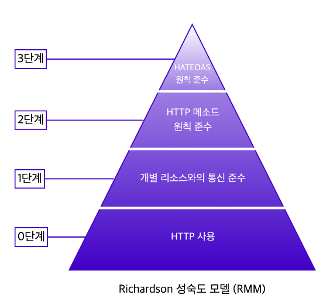

### [REST(Representational State Transfer)]

- 웹에 존재하는 모든 자원(이미지, 동영상, DB 등)에 고유한 URI를 부여해 활용하는 것

- HTTP URI를 통해 자원을 명시하고, HTTP Method를 통해 해당 자원(URI)에 대한 CRUD Operation을 적용하는 것

> CRUD Operation

    Create : 데이터 생성(POST)
    Read : 데이터 조회(GET)
    Update : 데이터 수정(PUT, PATCH)
    Delete : 데이터 삭제(DELETE)

#### [REST 구성요소]

- 자원(Resource) : HTTP URI (Uniform Resource Identifier)
- 자원에 대한 행위(Verb) : HTTP Method (POST, GET, PUT, DELETE, PATCH 등)
- 자원에 대한 행위의 내용(Representations) : HTTP Message Pay Load

#### [REST의 특징]

- Server-Client (서버-클라이언트 구조)

  - 클라이언트와 서버 사이에 명확한 분리 -> 독립적으로 발전 가능
  - 클라이언트: 사용자 인터페이스와 관련된 책임
  - 서버: 리소스의 관리와 관련된 책임

- Stateless(무상태)

  - 각 요청이 서버에 저장된 이전 요청의 정보를 참조하지 않음
  - 따라서 각 요청은 서버가 요청을 이해하고 처리하는 데 필요한 모든 정보를 포함해야 함

- Cacheable(캐시 처리 가능)

  - 클라이언트가 이전에 받은 응답을 재사용할 수 있음 -> 서버의 부하를 줄이고 성능 향상

- Layered System(계층화)

  - 클라이언트는 보통 최종 서버에 직접 연결되지만, REST에서는 중간에 다른 서버가 존재할 수 있음
  - 계층 구조 -> 보안 기능 추가 가능

- Uniform Interface(인터페이스 일관성)
  - REST는 일관된 인터페이스를 지원하며 이를 통해 시스템의 복잡성을 줄이고, 독립적으로 컴포넌트를 발전시키는 것을 가능하게 함

#### [REST의 장점]

- HTTP 프로토콜의 인프라를 그대로 사용하므로 REST API 사용을 위한 별도의 인프라를 구축할 필요 X
- HTTP 표준 프로토콜을 따르는 모든 플랫폼에서 사용 가능
- REST API 메시지가 의도하는 바를 명확하게 나타내므로 의도하는 바를 쉽게 파악할 수 있음

#### [REST의 단점]

- 표준이 존재하지 않아 정의가 필요함
- HTTP Method 형태가 제한적임
- 구형 브라우저에서 호환이 되지 않아 지원하지 않는 동작 多

---

### [REST API]

- REST의 원리를 따르는 API
- 웹(http)의 장점을 최대한 활용할 수 있는 아키텍처
- 웹에서 사용되는 데이터나 자원을 HTTP URI로 표현하고, HTTP 프로토콜을 통해 요청과 응답을 정의하는 방식

### [REST API 설계 규칙]

1. URI는 동사보다는 명사를, 대문자보다는 소문자를 사용하여야 한다.

> Bad Example http://khj93.com/Running/
> Good Example http://khj93.com/run/

2. 마지막에 슬래시(/)를 포함하지 않는다.

> Bad Example http://khj93.com/test/  
>  Good Example http://khj93.com/test

3. 언더바(\_) 대신 하이픈(-)을 사용한다.

> Bad Example http://khj93.com/test_blog
> Good Example http://khj93.com/test-blog

4. 파일확장자는 URI에 포함하지 않는다.

> Bad Example http://khj93.com/photo.jpg  
>  Good Example http://khj93.com/photo

5. 행위를 포함하지 않는다.

> Bad Example http://khj93.com/delete-post/1  
>  Good Example http://khj93.com/post/1  
>  

#### [RMM(Richardson Maturity Model)]

- 리처드슨(Richardson)이 고안한 REST API의 성숙도 모델
- 총 4단계로 나누어짐
- 각 단계의 조건에 만족할 수록 REST API에 가까워짐
  - 보통 2단계까지 충족하면 RESTful API라 부름
  - REST API 설계 시 3단계를 적용시키기 어려운 경우 多

1. 0단계
   - 단순히 HTTP 프로토콜을 사용
2. 1단계
   - 개별 리소스와의 통신을 준수
   - 모든 자원은 개별 리소스에 맞는 엔드포인트(Endpoint)를 사용해야 하며 요청하고 받는 자원에 대한 정보를 응답으로 전달해야 함
3. 2단계
   - CRUD(Create, Read, Update, Delete)에 맞게 적절한 HTTP 메서드 사용
   - (0단계와 1단계 예시에서는 모든 요청을 CRUD와 상관없이 POST 메서드를 사용함)

---

### [REST ful]

- REST API의 설계 규칙을 올바르게 지키도록 설계된 시스템
- RMM의 2단계까지 만족하도록 설계된 경우

> REST ful 하지 못한 경우

    Ex1) CRUD 기능을 모두 POST로만 처리하는 API
    Ex2) 경로에 resource, id 외의 정보가 들어가는 경우 (/students/updateName)
