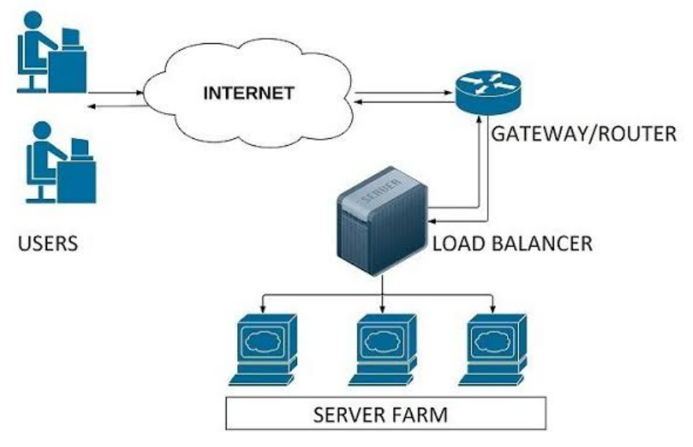

### [로드밸런싱(Load Balancing)]

- 특정 서버 또는 네트워크 허브에 부하가 집중되지 않도록 트래픽을 분산시키는 것
  - 로드밸런서는 클라이언트의 요청 및 네트워크의 트래픽이 집중되는 서버 또는 네트워크 허브 사이에 위치하여 로드밸런싱 수행
- 효과: 가용성 및 응답시간 최적화

#### [로드밸런싱의 기능]

1. Health Check (상태 확인)
   - 서버들에 대한 주기적인 상태 확인을 통해 서버들의 장애 여부를 판단하여, 정상 동작 중인 서버로만 트래픽을 보냄
2. Tunneling (터널링)
   - 데이터 스트림을 인터넷 상에서 가상의 파이프를 통해 전달시키는 기술
   - 연결된 상호 간에만 캡슐화된 패킷을 구별해 해제하게 함
3. NAT (Network Address Translation)
   - 내부 네트워크에서 사용하는 사설 IP 주소와 로드밸런서 외부의 공인 IP 주소 간의 변환 역할
   - 목적: 여러 개의 호스트가 하나의 공인 IP 주소를 통해 접속하는 것
4. DSR (Destination Network Address Translation)
   - 서버에서 클라이언트로 트래픽이 되돌아가는 경우, 네트워크 장비나 로드밸런서를 거치지 않고 바로 클라이언트를 찾아가는 방식 -> 로드밸런서의 부하 줄임

#### [로드밸런싱 알고리즘]

1. 라운드 로빈 방식
   - 서버로 들어온 요청을 순서대로 돌아가며 배정하는 방식
2. IP 해시 방식
   - 클라이언트의 IP 주소를 특정 서버로 매핑하여 요청을 처리하는 방식
3. 최소 연결 방식 (Least Connection Method)
   - 요청이 들어온 시점에 가장 적은 연결상태를 보이는 서버에 우선적으로 트래픽 할당하는 방식
4. 최소 응답시간 방식 (Least Response Time Method)
   - 서버의 현재 연결 상태와 응답시간을 모두 고려하여, 가장 짧은 응답 시간을 보내는 서버로 트래픽을 할당하는 방식

### [L4 VS L7 스위치]

- 7장 네트워크 기기의 어플리케이션 계층 기기에서 확인 가능
