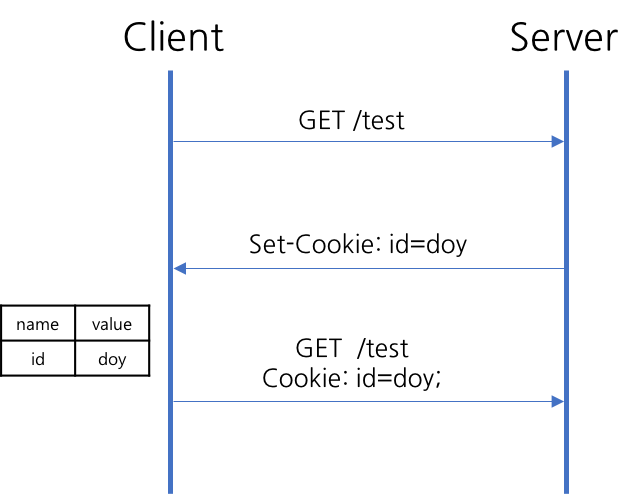
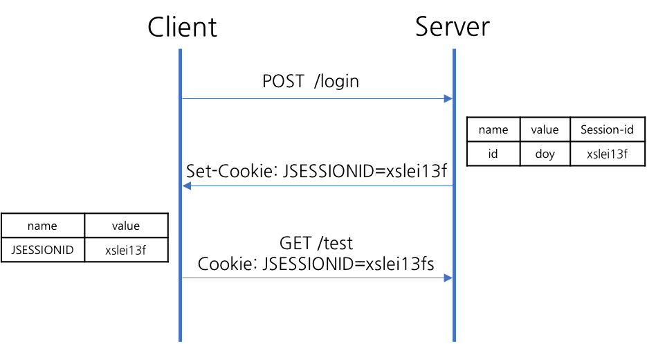
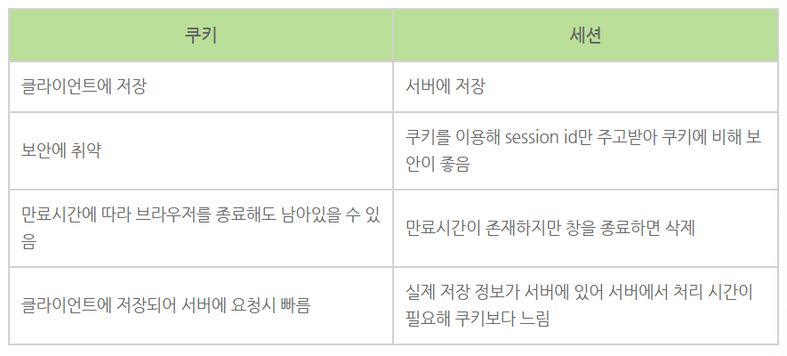

> **HTTP 프로토콜의 약점(Stateless : 상태정보 유지 불가)을 보완하기 위한 개념**

### [쿠키(Cookie)]

- 클라이언트 로컬에 저장되어 있는 키와 값이 들어있는 파일이다
- 이름, 값, 유효시간, 경로 등을 포함하며 클라이언트의 상태 정보를 브라우저에 저장하여 참조
- EX) 자동 로그인, 아이디 저장

#### [동작 방식]

1. 웹 브라우저가 서버에 페이지 요청
2. 웹 서버가 상태를 유지하고 싶은 값을 쿠키로 생성
3. 서버가 응답할 때 HTTP 헤더에 쿠키를 포함해 전송 (Set-Cookie: key=value)
4. 전달 받은 쿠키를 웹 브라우저에서 관리하고 있다가 다음 요청 때 쿠키를 HTTP 헤더에 넣어서 전송

---

### [세션(Session)]

- 일정 시간 동안 같은 브라우저로부터 들어오는 요청을 하나의 상태로 보고 그 상태를 유지하는 기술
- **서버에 접속한 이후부터 브라우저를 종료**할 때까지 유지되는 상태
- EX) 로그인 유지 (웹 페이지 내에서 화면 이동하더라도 로그인 풀리지 않음)
  ​

#### [동작 방식]

1. 웹 브라우저가 서버에 페이지 요청
2. 서버가 응답할 때 쿠키에 session id를 담아서 전송
3. 웹 브라우저는 브라우저를 닫기 전까지 요청할 때 전달받은 session id를 담은 쿠키를 HTTP 헤더에 넣어서 전송
4. 서버는 session id를 확인해 해당 세션에 관련된 정보를 확인한 후 응답

### [쿠키 VS 세션]

> **상태 정보의 저장 위치**

    - 쿠키: 클라이언트
    - 세션: 서버
