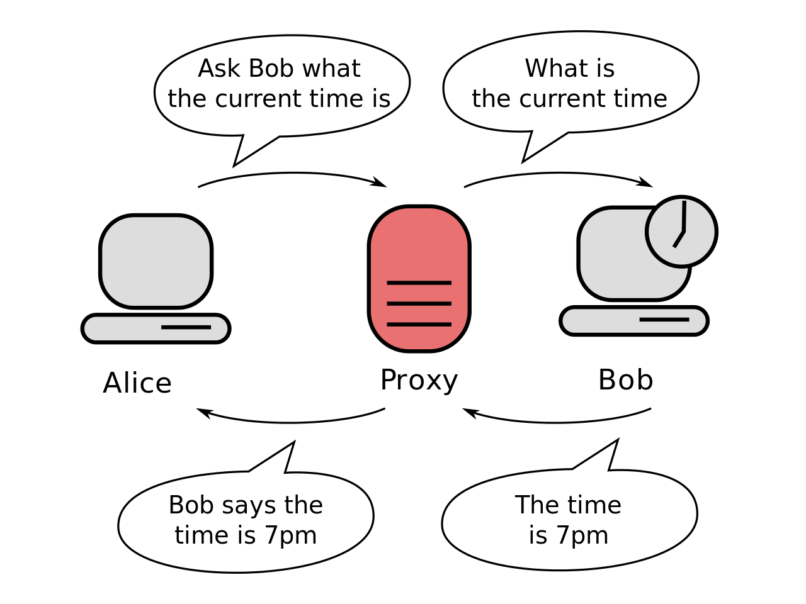
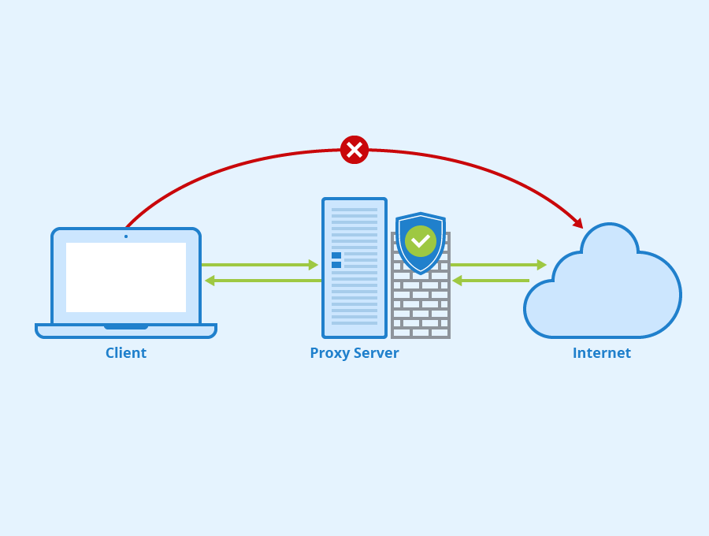

### [프록시 서버]

- 클라이언트가 자신을 거쳐 다른 네트워크에 접속할 수 있도록 중간에서 대리해주는 서버
- 서버와 클라이언트 사이에서 대리로 통신을 수행해주는 것을 프록시라고 하고 그 기능을 하는 서버를 프록시 서버
- 서버와 클라이언트 사이에서 요청과 응답을 처리

#### [통신 과정]

1. 클라이언트에서 프록시 서버로 데이터 전송
2. 프록시 서버에서 다시 웹 서버로 웹 요청
3. 웹 서버에서 프록시 서버로 웹 응답
4. 프록시 서버에서 클라이언트로 데이터 전송

#### [사용 목적]

- 캐시 데이터 사용
  - 일부 프록시 서버는 요청된 내용을 캐시로 저장 -> 캐시에 저장되어있는 내용에 대한 재요청은 서버에 따로 접속할 필요 X (저장된 내용을 그대로 돌려줌)
  - 전송 시간 절약, 외부 트래픽 줄어듬 -> 네트워크 병목 현상도 방지
- 보안 (프록시 방화벽)
   - 중간에 프록시 서버에 경유하면 IP를 숨길 수 있음 -> 방화벽으로 사용되기도 함
- 접속 우회
  - 우회에 사용할 서버 주소와 포트를 설정해주면 설정한 서버에서 접속한 것처럼 속일 수 있음
