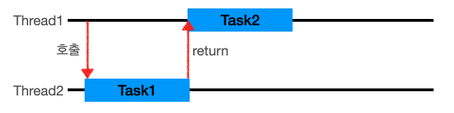
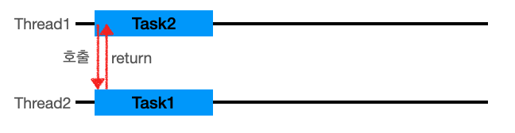

### [Blocking vs Non-blocking]

> **주로 I/O에서 사용되는 개념**

#### [Blocking]

- 요청한 작업을 마칠 때까지 계속 대기 -> 즉시 return
- return 값을 받아야 끝남
- 요청한 작업을 마칠 때까지(return 값을 받을 때까지) 계속 대기하며 한 thread를 계속 사용/대기

#### [Non-Blocking]

- 호출된 함수가 바로 return -> 호출한 함수에게 제어권을 넘겨줌 -> 호출한 함수는 다른 일을 할 수 있게 됨
- 하나의 Thread가 여러 개의 I/O 처리 가능

---

### [Synchronous(동기) vs Asynchronous(비동기)]

#### [Synchronous(동기)]

- task1이 끝날때까지 기다렸다 task2 시작
- 작업 요청을 했을 때 요청의 결과값(return)을 **직접** 받음
- 요청의 결과값이 return값과 **동일**
- **호출한 함수**가 작업 완료를 신경 씀

#### [Asynchronous(비동기)]

- Thread1이 task를 시작한뒤, 완료를 기다리지 않고 Thread1은 다른 일을 처리할 수 있음
- 작업 요청을 했을 때 요청의 결과값(return)을 **간접**적으로 받음
- 요청의 결과값이 return값과 **다를** 수 있음
- 해당 요청 작업은 별도의 스레드에서 실행
- **callback 함수(호출된 함수)**가 작업 완료를 신경 씀

---

### [Blocking/Non-Blocking vs 동기/비동기]

#### [blocking/non-blocking]

> 호출되는 함수가 바로 return 하는지? 아닌지?

#### [동기/비동기]

> 호출되는 함수의 작업 완료 여부를 누가 신경쓰는지?
