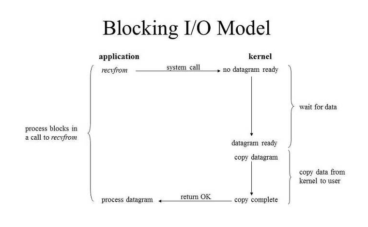
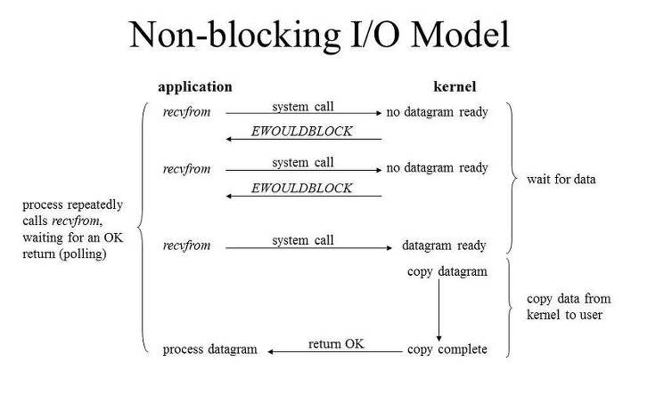

> **I/O 작업은 Kernel level에서만 수행 가능 -> Process/ Thread는 커널에게 I/O를 요청해야 함**

### [Blocking I/O]

1.  Thread가 커널에게 I/O 요청하는 함수 호출
2.  커널이 작업 완료하면 작업 결과 반환 받음

- Thread는 I/O작업동안 자신의 작업 중단한 채 대기 -> Resource 낭비
- 모든 클라이언트가 블로킹 되는 것을 막기 위해 각각 쓰레드를 따로 생성해야 함 -> 클라이언트가 많아질수록, 쓰레드도 같이 많아짐
  -> Context Switching 많이 발생 -> 서버 비효율적으로 동작

---

### [Non-Blocking I/O]

> **I/O 작업동안 User Process 작업 중단하지 않음**

1. Process가 recvfrom(커널에게 I/O 요청하는 함수) 호출
2. 커널은 "EWOULDBLOCK"을 return (이 요청에 대한 데이터 응답은 바로 못함)
3. 커널은 이 네트워크 요청에 대해 데이터를 받아오고 있음
4. return 값을 받았음으로, app에서 다른 작업도 처리할 수 있음
5. 반복적으로 데이터 요청
6. recvBuffer에 유저가 이용가능한 데이터가 있을 경우 -> 데이터 copy -> 리턴함
