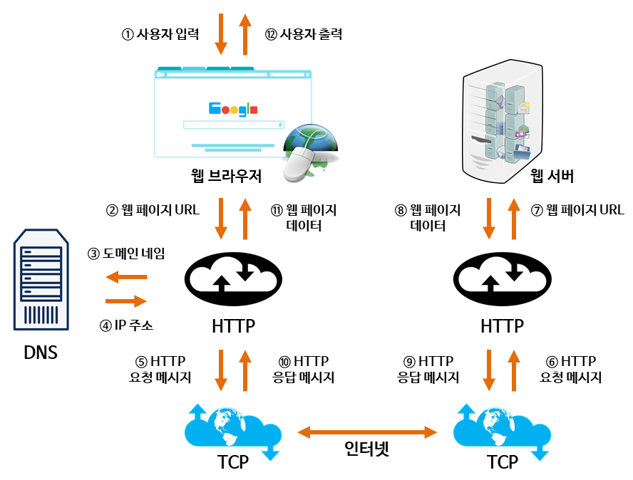

### [DNS(Domain Name System)]

- 문자로 된 도메인 네임을 컴퓨터가 이해할 수 있는 IP 주소로 변환하는 **분산** 데이터베이스
- 응용 계층 (Application Layer)에 해당함
- UDP 방식 사용
  - 연결을 위한 준비 동작과정에 TCP를 사용하기에는 비용이 큼
  - DNS message는 40byte로 크기가 작아서 유실될 가능성이 적음

### [DNS의 구조]

- root를 중심으로 계층적인 구조를 가짐

#### [Root 서버]

- 전 세계에 13대 구축되어 있음

#### [TLD(Top-Level Domain) 서버]

- root 바로 아래에 존재
- 사용하고 있는 집단을 식별하도록 만
- EX) com, org, net, edu, gov, kr

#### [Authoritative(책임) DNS 서버]

- 개인이 등록하여 사용할 수 있음
- 인터넷에 접근하기 쉬운 호스트를 가진 모든 기관은 호스트 네임을 IP 주소로 매핑하도록 함

#### [Local DNS 서버]

- 각 네트워크 기관들이 DNS 캐시처럼 내부에서 요청되는 DNS 쿼리들에 대한 호스트와 아이피 주소 매핑에 대한 결과들을 캐싱하고 있음.

---

### [웹 통신 흐름]

> 주소창에 www.naver.com을 치고 난 다음의 과정?

1. 사용자가 브라우저에 URL(www.naver.com)을 입력
2. DNS 서버에 도메인 네임으로 서버의 진짜 주소를 찾음
3. IP 주소로 웹 서버에 TCP 3 handshake로 연결 수립
4. 클라이언트는 웹 서버로 HTTP 요청 메시지를 보냄
5. 웹 서버는 HTTP 응답 메시지를 보냄
6. 도착한 HTTP 응답 메세지는 웹 페이지 데이터로 변환되고, 웹 브라우저에 의해 출력
