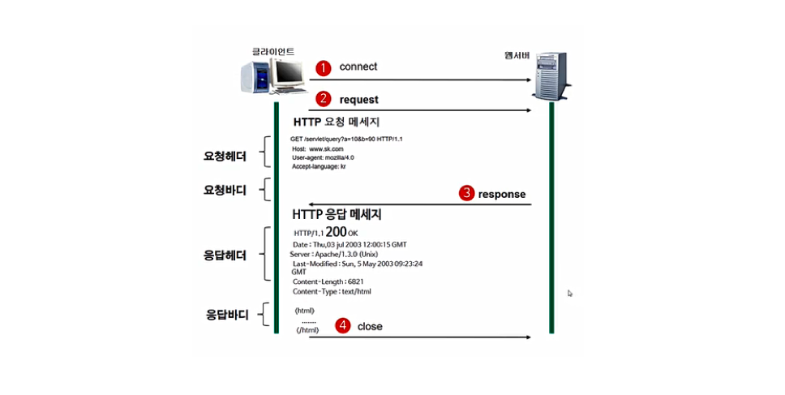
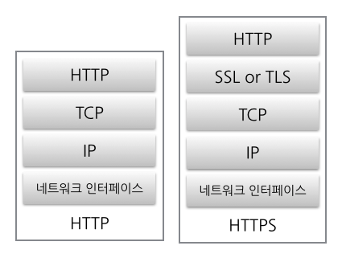

### [HTTP(Hyper Text Transfer Protocol)]

- HTML 문서와 같은 리소스들을 가져올 수 있도록 해주는 프로토콜
- 웹 브라우저와 웹 서버간의 통신 프로토콜
- TCP/ UDP 사용, 80번 포트 사용

#### [HTTP 구조]

- 애플리케이션 계층의 프로토콜로 TCP/IP 위에서 작동
- Method, Path, Version, Headres, Body 등으로 구성

#### [HTTP 특징]

- **비연결 지향(Connectionless)**
  - 클라이언트가 request를 서버에 보내고, 서버가 클라이언트에게 response를 보내면 바로 연결을 끊음
- **무상태(Stateless)**
  - 연결을 끊는 순간 클라이언트와 서버의 통신은 끝나며 상태 정보를 유지하지 않음

#### [장점]

- 클라이언트와 서버가 계속 연결된 형태가 아니기 때문에 클라이언트와 서버 간의 최대 연결 수보다 훨씬 **많은 요청과 응답을 처리**할 수 있음
   

#### [단점]

- 연결을 끊어버리기 때문에, 클라이언트의 이전 상황을 알 수가 없음 -> Cookie와 같은 기술의 등장

#### [HTTP 통신 과정]

- 서버/클라이언트 모델을 따름

> 클라이언트 -> 요청 -> 서버 -> 응답 -> 클라이언트

1. 클라이언트가 원하는 서버에 접속
2. 클라이언트가 서버에 요청
3. 서버가 요청에 따른 응답 결과를 다시 클라이언트에 응답
4. 응답이 끝나고 나면 서버와 클라이언트의 연결은 끊김

---

### [HTTPS]

- HTTP에 데이터 암호화가 추가된 프로토콜
- 443번 포트를 사용
- **대칭키 암호화와 공개키 암호화를 모두 사용** -> 빠른 연산 속도와 안정성 보장
  - 처음 연결을 성립하여 안전하게 세션키를 공유하는 과정에서 **공개키** 사용
  - 이후 데이터를 교환하는 과정에서 빠른 연산 속도를 위해 **대칭키** 사용

#### [특징]

- 소켓 통신에서 일반 텍스트를 이용하는 대신에, 웹 상에서 SSL이나 TLS 프로토콜을 통해 세션 데이터 암호화
- 기밀성, 데이터 무결성, ID 및 디지털 인증서를 사용한 인증 제공
- 금융 정보나 메일 등 중요한 정보를 주고받는 경우에 사용

#### [​장점]

- 네트워크 상에서 열람, 수정이 불가능하므로 안전함
- 동일 키워드의 사이트에서 HTTP사이트보다 HTTPS 사이트가 우선 순위를 차지 -> SEO(검색엔진최적화)에 유리
   

#### [단점]

- 암호화 과정 -> 웹 서버에 부하를 줌
- 설치 및 인증서를 유지하는데 추가 비용이 발생
- 인터넷 연결이 끊긴 경우 재인증 시간이 소요됨
  - 소켓 자체에서 인증을 하기 때문에 인터넷 연결이 끊기면 소켓도 끊어져서 다시 HTTPS 인증이 필요함
    (HTTP는 비연결형으로 웹 페이지를 보는 중 인터넷 연결이 끊겼다가 다시 연결되어도 페이지를 계속 볼 수 있음)

#### [HTTPS 통신 흐름]

1. 서버는 공개키, 개인키를 만들고 인증기관(CA)에 자신의 정보와 공개키 관리 계약을 맺음
2. 인증기관은 인증기관의 개인키로 사이트에서 제출한 정보(서버 공개키, 공개키 암호화 방법)를 암호화하여 인증서를 만들어 서버에 제공
3. 사용자가 사이트에 접속하면 서버는 자신의 인증서를 웹 브라우저(클라이언트)에게 제공
4. 웹 브라우저는 인증기관의 공개키(이미 알고있음)로 인증서를 해독하여 검증 -> 사이트 정보와 서버의 공개키를 얻음
5. 얻은 서버의 공개키로 대칭키를 암호화하여 다시 서버에 보냄
6. 서버는 암호화된 대칭키를 자신의 개인키로 복호화 하여 클라이언트와 동일한 대칭키 획득
7. 이 후부터는 전달 받은 대칭키로 데이터를 주고 받음
8. 세션이 종료되면 대칭키는 폐기됨

---

### [HTTP VS HTTPS]

- HTTP 프로토콜
  - 웹 상에서 클라이언트와 서버 간에 요청/응답으로 정보를 주고 받을 수 있는 프로토콜
- HTTPS 프로토콜
  - **HTTPS = HTTP + 암호화 + 증명서 + 완전성**
  - HTTP의 보안적 약점을 보완한 프로토콜
  - SSL이나 TLS 프로토콜을 통해 세션 데이터를 암호화
