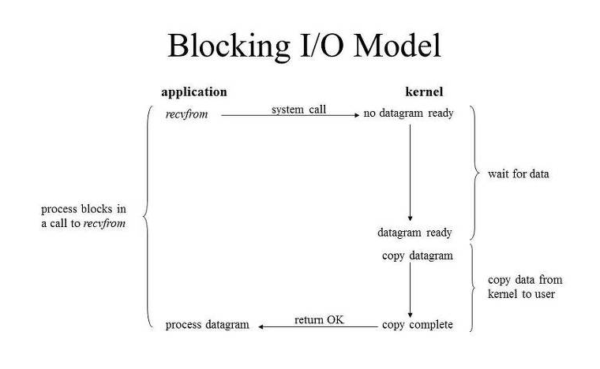

> **I/O 작업은 Kernel level에서만 수행 가능 (유저 레벨에서 직접 처리할 수 없음) -> Process/ Thread는 커널에게 I/O를 요청해야 함**

### [Blocking I/O]

1. Thread(유저 프로세스)가 커널에게 I/O 요청 함수 호출
2. I/O 작업을 처리하기 위해 유저 레벨(User Level)에 있던 Application이 시스템 함수(system call) 호출
3. **컨텍스트 스위칭(Context Switching)** 발생
4. 커널 레벨(Kernel Level)에서 해당 I/O 작업이 끝나고 데이터를 반환
5. 어플리케이션 단의 thread에 걸렸던 Block이 풀림

[한계]

- Thread는 I/O작업동안 자신의 작업 중단한 채 대기 -> **Resource 낭비**
- 모든 클라이언트가 블로킹 되는 것을 막기 위해 각각 쓰레드를 따로 생성해야 함 -> 클라이언트가 많아질수록, 쓰레드도 같이 많아짐
  -> Context Switching 많이 발생 -> 서버 비효율적으로 동작

---

### [Non-Blocking I/O]

-> Blocking 방식의 비효율성 극복

> **I/O 작업동안 User Process 작업 중단하지 않음**

1. Process가 recvfrom(커널에게 I/O 요청하는 함수) 호출
2. 커널은 "EWOULDBLOCK"을 바로 return (이 요청에 대한 데이터 응답은 바로는 못함)
3. 커널은 이 네트워크 요청에 대해 데이터를 받아오고 있음
4. 서버는 클라이언트가 요청한 사이즈에 맞는 데이터를 반환하기 위해 recvBuffer에 데이터 축적
5. return 값을 받았음으로, app에서 다른 작업도 처리할 수 있음
6. 반복적으로 데이터 요청
7. 데이터의 축적이 끝나면, 반환되어 클라이언트에서 송신한 사이즈의 데이터를 받아올 수 있게 됨

[한계]

- 클라이언트가 송신한 데이터가 전부 도착했는지 계속 확인해야함
- 데이터가 준비되었는지(패킷 완성) 확인하는 과정에서 수많은 클라이언트들의 요청이 동시 다발적으로 일어날 경우,
  CPU에게 부담 가중
