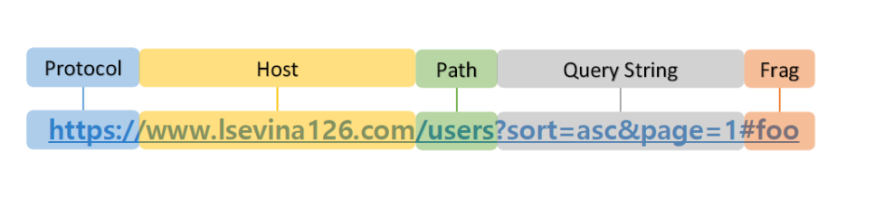
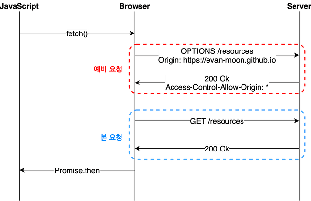

### [SOP(Same-origin policy)(동일 출처 정책)]

- **동일**한 출처(origin)에서만 리소스를 공유할 수 있다는 정책
- 다른 출처의 리소스를 사용하는 것을 제한하는 보안 방식

> 동일 출처

    
    - protocol, host, port가 같아야 같은 출처임

> 예외

    - CORS 정책을 지킨 리소스 요청
        - 다른 출처에 있는 리소스를 가져와서 사용하는 일 多

---

### [CORS(Cross-Origin Resource Sharing)(교차 출처 리소스 공유)]

- 다른 출처의 자원을 공유하도록 접근을 허용하는 것
- 추가적인 HTTP 헤더를 사용해 한 출처에서 실행중인 웹이 다른 출처의 선택한 자원에 접근할 권한을 부여하도록 브라우저에 알려주는 체제

#### [CORS 동작 방식]

1. 클라이언트 브라우저에서 서버 리소시 요청
   - 브라우저는 요청 헤더에 **Origin** 이라는 필드에 요청을 보내는 출처를 보냄
   - package.json -> proxy값 설정 (브라우저와 같은 도메인)
     -> 클라이언트와 서버가 직접적으로 소통하는 것이 아니라, 프록시 서버를 통해 **서버 대 서버**간의 소통을 하기 때문에 CORS 문제 발생 X
2. 이후 서버 측에서 응답을 할 때
   - **Access-Control-Allow-Origin**이라는 값에 "리소스를 접근하는 것이 허용된 출처"를 보냄
3. 이를 받은 브라우저
   - 본인이 보낸 origin과 비교해 유효한 응답인지 결정

CORS의 시나리오로는 1) Preflight / 2) Simple / 3) Credentialed Request 가 있다.

1. **Preflight Request(예비 요청)**

   - 브라우저가 본 요청을 보내기 전에 보내는 요청
   - 서버는 예비 요청에 대한 응답으로 **허용/금지하는 정보**를 응답 헤더에 담아 보냄
   - 이후 브라우저는 Request와 Response의 허용 정책을 비교한 후, 안전하다고 판단되면 같은 end-point로 본 요청을 보냄
   - 서버가 본 요청에 대해서 응답하면 최종적으로 이 응답 데이터를 브라우저에 넘겨줌
      

   * 과정을 통해 브라우저 스스로 이 요청을 보내는 것이 안전한지 확인

2. **Credentialed Request(인증된 요청)**

   - 기존 예비요청에서 보안을 더 강화하고 싶을 때 사용하는 방식
   - 브라우저가 제공하는 비동기 리소스 요청 API, fetch API는 별도의 옵션 없이 브라우저의 쿠키 정보나 인증과 관련된 헤더를 함부로 요청에 담지 X

   - 요청에 인증정보가 담겨있는 상태에서 다른 출처 리소스를 요청하면, 브라우저는 CORS 정책 위반 여부를 검사하는 툴에 다음 두가지 조건을 추가함

   1. Access-Control-Allow-Origin 에는 모든 요청을 허용하는 \* 를 사용할 수 없으며, 명시적인 URL을 써야만 함
   2. 응답 헤더에는 반드시 Access-Controll-Allow-Credentials: true 가 존재해야함

     
    - Credentials 옵션: 요청에 인증과 관련된 정보를 담을 수 있게 해주는 옵션
        - same-origin(default)- 같은 출처 간 요청에만 인증 정보를 담을 수 있음
        - include- 모든 요청에 인증 정보를 담을 수 있음
        - omit- 모든 요청에 인증 정보를 담지 않음
