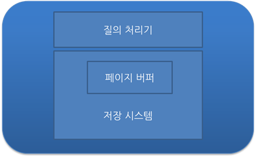

# 트랜잭션이란?

---

데이터베이스의 상태를 변환시키는 하나의 논리적 기능을 수행하기 위한 **작업의 단위** 또는 한꺼번에 모두 수행되어야할 **일련의 연산들**

- 상태를 변화시킨다는 것 : SQL 질의어(SELECT, INSERT, DELETE, UPDATE)를 통해 DB에 접근하는 것
- 작업 단위 : 많은 SQL 명령문들을 사람이 정하는 기준에 따라 정하는 것
    - A가 B에게 N원을 송금
        - A의 계좌에서 N원 차감(UPDATE)
        - B의 계좌에 N원 추가 (UPDATE)
    - 위 경우 작업 단위가 : 출금 UPDATE + 입금 UPDATE되고 이를 하나의 트랜잭션이라한다.
        - `commit` : 두 작업 모두 성공적으로 완료되어야 하나의 작업(트랜잭션)이 완료된다.
        - `rollback` : 작업 단위에 속하는 쿼리 중 하나라도 실패하면 모든 쿼리문을 취소하고 이전 상태로 돌려놓아야한다.

## 특징

- `원자성(Atomicity)` :  트랜잭션이 DB에 **모두 반영**되거나, **전혀 반영되지 않아야** 된다.
- `일관성(Consistency)` : 트랜잭션의 작업 처리 **결과**는 항상 **일관성** 있어야 한다.
- `독립성(Isolation)` : 둘 이상의 트랜잭션이 동시에 병행 실행되고 있을 때, 어떤 트랜잭션도 다른 트랜잭션 연산에 **끼어들 수 없다**.
- `지속성(Durability)` : 트랜잭션이 성공적으로 완료되면, 결과는 **영구적으로 반영**되어야 한다.

### commit

하나의 트랜잭션이 **성공적**으로 끝났고, DB가 일관성있는 상태일 때 이를 알려주기 위해 사용하는 연산 

### rollback

하나의 트랜잭션 처리가 **비정상적**으로 종료되어 트랜잭션 원자성이 깨진 경우 

트랜잭션이 정상적으로 종료되지 않았을 때, last consistent state(ex. Transaction의 시작 상태)로 rollback 할 수 있다. 

## 트랜잭션 관리를 위한 DBMS 전략

1. DBMS의 구조
    
    
    
    - **Query Processor(질의 처리기)**, Storage System(저장 시스템) 크게 두가지로 나눌 수 있다.
    - 입출력 단위 : 고정 길이의 page 단위로 disk에 읽거나 쓴다.
    - 저장 공간 : 비휘발성 저장 장치인 disk에 저장하고 일부분을 **main memory에 저장**한다.
2. Page Buffer Manager or Buffer Manager
    
    DBMS의 Storage System에 속하는 모듈 중 하나로, Main memory에 유지하는 **페이지를 관리하는 모듈** 
    
3. UNDO
    - 필요한 이유
        - 수정된 page들이 **Buffer 교체 알고리즘**에 따라 **디스크에 출력**될 수 있음
        - Buffer 교체는 transaction과는 무관하게 buffer의 상태에 따라서 결정된다.
        
        → 정상적으로 종료되지 않은 transaction이 변경한 page들을 **원상복**구 해야한다 : `UNDO`
        
    - 정책(수정된 페이지를 디스크에 쓰는 시점으로 분류)
        - steal : 수정된 페이지를 **언제든지** 디스크에 쓸 수 있는 정책
            - 대부분의 DBMS가 채택
            - UNDO logging과 복구를 필요로 한다.
        - ¬steal : 수정된 페이지들을 EOT(End of Transaction)까지는 **버퍼에 유지**하는 정책
            - UNDO 작업이 필요하지 않지만, 매우 큰 메모리 버퍼가 필요
4. REDO : commit한 transaction의 수정을 **재반영**하는 **복구** 작업 
    - Buffer 관리 정책에 영향을 받는다.
        - Transaction이 종료되는 시정에 해당 transaction이 수정한 page를 **디스크에 쓸 것인가 아닌가** 기준
        - FORCE : 수정했던 모든 페이지를 Transaction **commit 시점에 disk에 반영**
            - transaction이 commit 되었을 때 수정된 페이지들이 disk 상에 반영되므로 redo 불필요
        - ¬FORCE : commit 시점에 반영하지 않는 정책
            - 대부분의 DBMS 정책
            - transaction이 disk 상의 db에 반영되지 않을 수 있기에 redo 복구 필요
            

# 트랜잭션 격리 수준 (Transaction Isolation Level)

---

Isolation level : 트랜잭션에서 **일관성 없는 데이터를 허용**하도록 하는 수준

## 필요성

- 데이터베이스는 트랜잭션이 독립적인 수행을 하도록 하기에, **Locking**을 통해 트랜잭션이 DB를 다루는 동안 **다른 트랜잭션이 관여하지 못하도록** 막는다.
- 하지만, 수많은 트랜잭션을 순차 처리하면 성능이 떨어질 것이다.
- 따라서 효율적인 Locking 방법이 필요하다.

## Isolation level 종류

1. Read Uncommitted (레벨 0)
    
    SELECT 문장이 수행되는 동안 해당 데이터에 shared lock이 걸리지 않는 계층
    
    - 트랜잭션에 처리중이거나, 아직 **commit되지 않은 데이터(Uncommitted)를 다른 트랜잭션이 읽는 것을 허용**한다.
    - 데이터베이스 일관성을 유지할 수 없다.
2. Read Committed (레벨 1)
    
    SELECT 문장이 수행되는 동안 해당 데이터에 shared lock이 걸리는 계층
    
    - 트랜잭션이 수행되는 동안 다른 트랜잭션이 접근할 수 없어 **대기**해야한다.
    - **Commit**이 이루어진 트랜잭션만 **조회 가능**하다.
    - 대부분의 SQL 서버가 Default로 사용하는 레벨이다.
3. Repeatable Read (레벨 2)
    
    트랜잭션이 완료될 때까지 SELECT 문장이 사용한 모든 데이터에 shared lock 걸리는 계층
    
    - 트랜잭션 범위 내에서 **조회한 데이터 내용이 항상 동일함**을 보장한다.
    - 다른 사용자는 트랜잭션 영역에 해당되는 데이터에 대한 **수정 불가능**
    - MySQL에서 Default로 사용하는 레벨
4. Serializable (레벨 3)
    
    트랜잭션이 완료될 때까지 SELECT 문장이 사용한 모든 데이터에 shared lock 걸리는 계층
    
    - **완벽한 읽기 일관성 모드** 제공
    - 다른 사용자는 트랜잭션 영역에 해당되는 데이터에 대한 **수정 및 입력 불가능**

## 고려사항

- 동시성을 증가 시키면 데이터 무결성에 문제가 발생하고, 데이터 무결성을 유지하면 동시성이 떨어진다
- 레벨을 높게 조정할 수록 발생하는 비용이 증가한다

## 낮은 레벨 활용 시 발생하는 현상

- Dirty Read
    - 커밋되지 않은 수정중인 데이터를 다른 트랜잭션에서 읽을 수 있도록 허용할 때 발생(레벨 0)
- Non-Repeatable Read
    - 한 트랜잭션에서 같은 쿼리를 두 번 수행할 때 그 사이에 다른 트랜잭션 값을 **수정 또는 삭제**하면서 두 쿼리의 결과가 **상이하게 나타나는 일관성**이 깨진 현상 (레벨 0, 1)
- Phantom Read
    - 한 트랜잭션 안에서 일정 범위의 레코드를 두 번 이상 읽었을 때, **첫번째 쿼리에서 없던 레코드가 두번째 쿼리에서 나타나는 현상** (레벨 0, 1, 2)
    - 트랜잭션 도중 새로운 레코드 삽입을 허용하기에 나타남
    

참고

https://gyoogle.dev/blog/computer-science/data-base/Transaction.html
