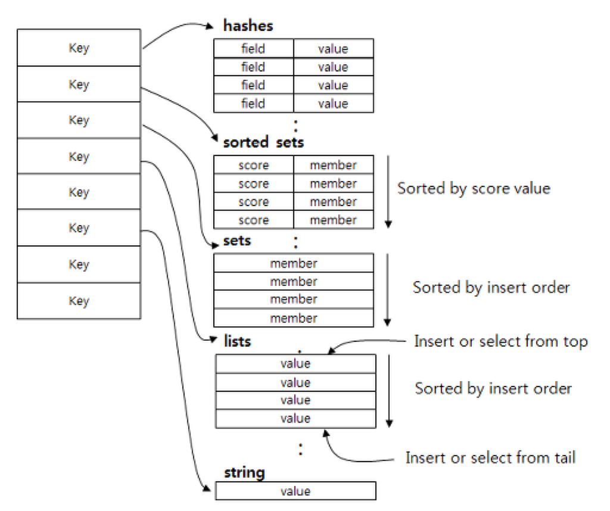

# Redis

---

in-memory 데이터베이스로 읽기, 쓰기를 빠르게 처리할 수 있는 원격 서버이다.

## 특징

- **단일 쓰레드 환경**으로 동작한다. 따라서 ‘key *’와 같이 저장된 모든 키를 보여주는 명령어 실행 시에는 조회 시간에 많은 시간이 걸려 그동안 다른 명령어를 처리할 수 없기에 주의해 처리해야한다.
- 다양한 데이터 구조, String, Set, Hash, List 등을 지원한다.
    
    
    
- **스냅샷**이나 **AOF**를 통해 **데이터를 복구**할 수 있다.
- Master-slave 구조를 통해 복제본을 만들 수 있다.

참고

사진 : https://bcho.tistory.com/1098
