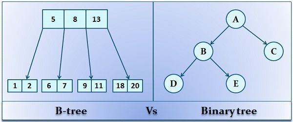
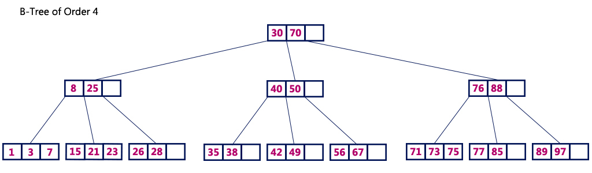
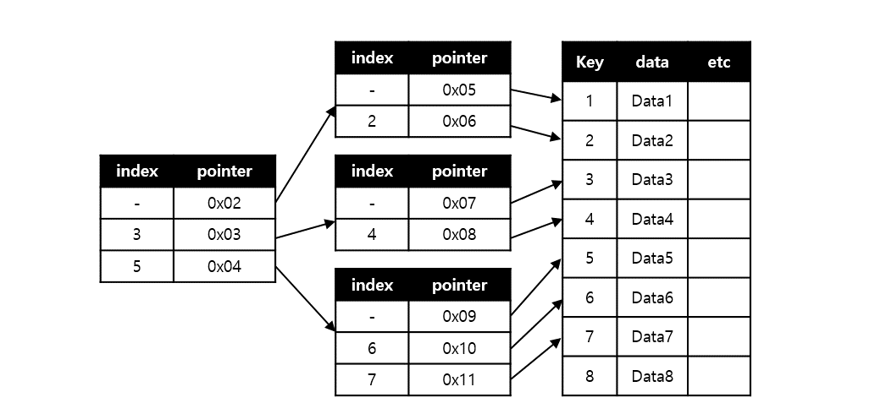

# B-Tree

- 이진트리는 하나의 노드에 하나의 값, 2개의 자식으로 구성되어 있다.
- B-tree의 경우 하나의 노드에 여러개의 값을 가질수 있다 → 최대 자식이 2개 이상일 수 있다.

https://techdifferences.com/difference-between-b-tree-and-binary-tree.html

## 노드 구분

- 루트(root) 노드 : 최상단에 위치한 노드
- 내부(internal) 노드/브랜치(branch )노드 : 루트노드와 리프 노드를 제외한 모든 노드
- 리프(leaf) 노드 : 자식이 없는 최하단에 위치한 노드

## 조건

1. 모든 노드들은 최대 m개의 자식을 가질 수 있다.
    - m=3이면 3차 B-tree
2. K개의 자식을 가진 리프가 아닌 노드는 k-1개의 키를 가지고 있다.
3. 모든 내부 노드는 최소 [m/2]개의 자식을 가져야한다. 
    - 3인경우 2
4. 모든 리프 노드들을 같은 레벨에 있어야 한다. 
5. 리프가 아닌 모든 노드들은 최소 2개의상의 자식을 가져야한다. 

## 특징

- 어떤 값에 대해서도 같은 시간에 결과를 얻을 수 있다 : 균일성(Balance)
    - 시간 복잡도 : O(logN)
        - 트리 높이
    - 균형 트리 : 루트로부트 리프까지의 거리가 일정한 트리 구조
- 테이블 갱신(INSERT/UPDATE/DELETE) 등의 반복을 통해 균형이 깨지고 성능이 악화될 수 있다.
- 균형을 회복하기 위해, 인덱스 같은 경우는 인덱스를 재구성해 트리의 규형을 되찾는 작업이 필요하다.

# B+Tree

https://8iggy.tistory.com/191

- B- tree의 확장개념으로, 리프노드에만 key와 data를 저장하고, 리프 노드끼리 Linked list로 연결되어있다.
    - B-tree의 경우 내부 또는 브랜치 노드에 key와 data를 담을 수 있다.

## 장점

- 더 많은 key 수용
    - 리프노드를 제외하고 데이터를 담아두지 않아 메모리를 더 확보할 수 있다.
    - 하나의 노드에 더 많은 key를 담아 트리의 높이가 낮아진다. (cache hit를 높일 수 있다)
- B- tree에 비해 빠르다
    - 풀 스캔시, B+tree는 리프 노드에 모든 데이터가 존재해 한번의 선형탐색만 진행하면 된다.

# B-tree와 B+tree의 차이점

|  | B-tree | B+tree |
| --- | --- | --- |
| 데이터 저장 | 리프노드, 브랜치 노드 | 리프노드 |
| 트리의 높이 | 높음 | 낮음 |
| 풀 스캔 시 검색속도 | 모든 노드 탐색 | 리프 노드에서 선형 탐색 |
| 키 중복 | X | O (리프 노드에 모든 데이터가 존재하므로) |
| 검색 | 자주 access되는 노드를 루트 노드에 가까이 배치할 수 있고, 루트 노드에서 가까울 경우, 브랜치 노드에도 데이터가 존재하기 때문에 빠르다.  | 리프노드까지 가야 데이터가 존재 |
| Linked list | X | 리프노드에 존재  |

참고

https://escapefromcoding.tistory.com/731

https://zorba91.tistory.com/293

https://8iggy.tistory.com/191
