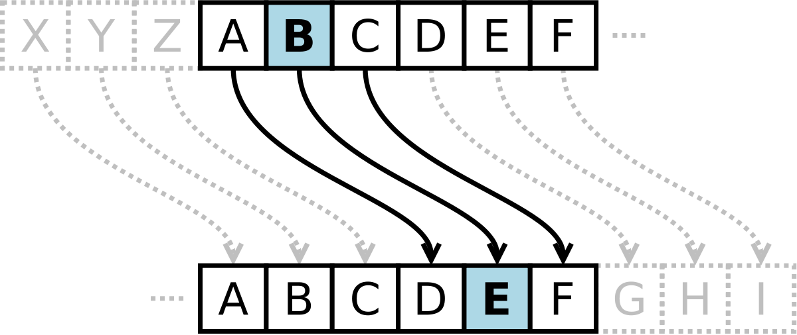

# 암호 개념 및 관련 용어

---

### 암호기술

송신자가 **데이터를 변형**해 침입자가 가로챈 데이터로부터 아무런 정보를 얻지 못하도록하기 위한 것. 

### 용어

- 평문 또는  원문 : 전달하고자 하는 **메시지의 원래 형태**
- 암호문 : **평문을** 제 3자가 알아볼 수 없는 형태로 **변형**된 문자 및 부호
- 암호화 : 암호 알고리즘을 통해 **평문을 암호문으로 변형하는 과정**
- 복호화 : **암호문**을 다시 평문으로 **복원하는 과정**
- 암호 알고리즘(암호 시스템) : 암호화, 복호화를 하기 위한 과정
- 키 : 암호화, 복호화를 위한 정보

# 대칭키&공개키

---

## 대칭키 암호란 ?

암호화와 복호화할 때 **동일한 키**가 사용되는 암호 시스템

### 암호화 과정

평문 → 암호화 알고리즘(공유된 비밀키 사용) → 암호문

### 복호화 과정

암호문 → 복호화 알고리즘(공유된 비밀키 사용) → 평문 

## 대칭키 종류

### 카이사르 암호/시저암호

: 평문의 각 철자를 알파벳 순서로 k번째 뒤에 오는 철자로 대치한다.

- 대칭키 암호화 이해를 위해 추가, 오래된 암호화 방식이라 사용되진 않는다.
- 아래 두개의 암호 알고리즘도 참고만 할 것 (깊게 들어가면 정보보안쪽으로 들어감)

### 블록 암호

: 메시지가 k비트의 블록 단위로 암호화된다.

- 스트림암호와 비교하여 알고리즘이 상대적으로 복잡해서 암호화 속도가 느리다는 단점이 있는 동시에 강한 암호화 강도가 있다는 장점이 존재한다.

### 스트림 암호

: 평문과 같은 길이의 키 스트림을 생성한다. 

- 암호화 방식은 평문과 키를 비트 단위로 XOR연산하여 암호문을 얻는다. 즉, 키의 길이 유동적
- 주로 음성, 오디오/비디오 스트리밍을 대상으로 한다.

## 공개키 암호란?

: 암호화, 복호화 **키가 다른** 암호 시스템으로 비대칭키라고도 한다.  

### 공개키 알고리즘

- 두개의 키를 사용한다.
    - **공개키** : 모두가 접근 가능한 키
    - **개인키** : 각 사용자 자신만이 소유하는 키(비공개)
- 두개의 키를 사용하기 때문에, 암호 알고리즘과 암호키를 알아도 **개인키를 모르면 복호화가 불가능** 하다.

### 과정 : A가 B에게 데이터를 전달할 때

1. B가 자신의 **공개키**를 공개
2. A가 B의 **공개키**로 문서를 **암호화**
3. 암호화된 문서를 B에게 전달
4. B가 자신만의 **개인키**로 A에게 전달받은 문서를 **해독** 

→ 전달 과정에서 문서를 가로채더라도 B의 개인키가 없다면 해독이 불가능하다. 

## 대칭키와 공개키 차이

| 대칭키 | 공개키 |
| --- | --- |
| 암호/복호에 동일한 키와 동일한 알고리즘이 사용된다. | 암호/복호에 동일한 알고리즘 사용하지만 서로 다른 키를 이용 |
| 수신자와 송신자는 키를 교환해야 한다. | 수신자와 송신자는 키 교환이 필요없다.(공개키 이용 |
| 공유한 키(비밀키)는 비밀로 유지 | 키 쌍중 하나(개인키)를 비밀로 유지 |
| 키 분배가 어렵다. | 공개키만 공개하면 된다. |
| 속도가 비대칭키 방식에 비해 1000배 빠르다. | 속도가 대칭키 방식에 비해 1000배 느리다. |
- 대칭키의 키분배가 어려운 이유
    - 대칭키를 이용해 서로 데이터를 교환할 때 **키를 포함해서 교환하면 중간에 탈취**를 당할 수 있는 문제가 발생할 수 있다.
    - 위 문제를 방지하기 위해 **각자** 비밀키를 가지고 있어야 하는데, 그러면 N명이 통신할 때 nC2개의 키 생성이 필요하다.
