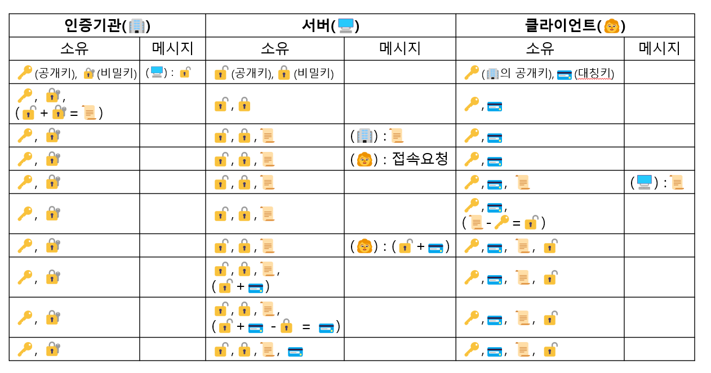
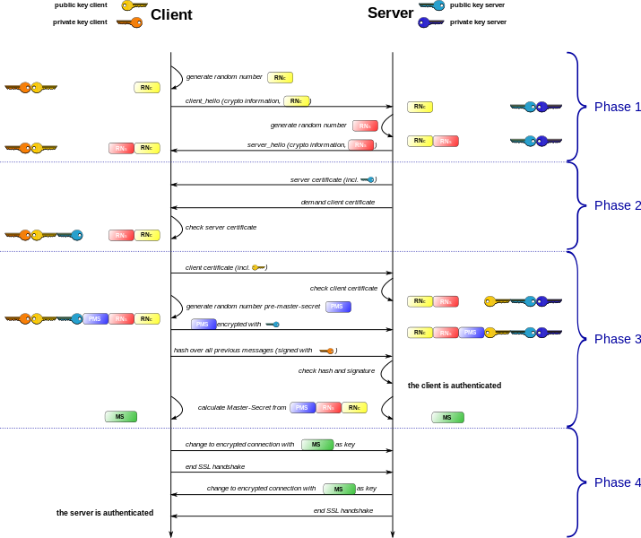

# HTTP&HTTPS

---

## HTTP

: 웹브라우저(Client)와 서버(Server)간의 웹페이지같은 자원을 주고 받을 때 쓰는 프로토콜. 

- 포트 번호 : 80
- 주로 HTML 문서를 주고받는데 사용됨.
- 단순 텍스트를 주고받아서 누군가가 네트워크에서 신호를 가로채어 볼 수 있다.

## HTTPS(HTTP+SSL)

 HTTP에서의 보안상 문제를 해결해준 프로토콜. 

- 포트 번호 : 443
- HTTPS는 SSL프로토콜을 이용해 공개키 암호화 방식을 사용

# SSL

---

: 신뢰할 수 있는 제 3자가 발행한 **인증서(CA)**를 통해 별도로 발급한 암호화 키를 가지고 송신자와 수신자가 **서로 암호화된 통신**을 하는 프로토콜 

- TLS는 SSL과 같은 의미로 통용된다.
- 대칭키와 공개키 암호기술을 모두 사용하는 **하이브리드 방식**을 사용한다.

### CA(Certificate Authority)

- SSL 인증서를 발급해주는 **인증기관**
- 공개키는 누구나 볼 수 있는 정보이지만 해당 **키**는 **신뢰**할 수 있어야한다, 이를 증명해주는 것이 인증기관의 역할이다.
- CA 인증기관 정보는 **브라우저 및 OS 등 저장소에 저장**되어 웹사이트 접속 시 검증할 수 있다.

## 암호 기술 : 하이브리드 방식

: 송신자가 공개키로 대칭키를 암호화해 상대방에게 전송하고, 수신자가 비밀키로 해당 대칭키를 복호화하는 방식.

- 해당 기술을 이용하면 대칭키 생성 후 메시지를 대칭키를 이용해 암호화, 복호화 하게 된다.
- 따라서, 대칭키의 장점인 빠른 속도와 비대칭키의 장점인 키 분배를 동시에 적용할 수 있다.

### 하이브리드 암호화

송신자는 클라이언트(👩), 수신자는 서버(🖥️)로 가정한다. 

| 클라이언트👩 | 서버🖥️ | 과정 |
| --- | --- | --- |
| 🔑 | 🔓,🔒 | 🖥️ : 공개키, 비밀키 생성 |
| 🔑,🔓 | 🔓,🔒 | 🖥️ : 공개키 배포 |
| 🔑,🔓 | 🔓,🔒 | 👩 : 대칭키 암호화 |
| 🔑,🔓 | (🔑+🔓),🔓,🔒 | 👩 : 공개키로 암호화된 대칭키 전달 |
| 🔑,🔓 | 🔑,🔓,🔒 | 🖥️ : 비밀키로 대칭키 복호화  |
1. 수신자(🖥️)가 **공개키🔓**와 **비밀키🔒**를 만든다.
2. 수신자(🖥️)는 **공개키🔓**는 모두에게 배포하고, **비밀키🔒**는 보관한다.
3. 송신자(👩)는 **공개키🔓**로 **대칭키🔑**를 **암호화**해 수신자(🖥️)에게 전송한다.
4. 수신자(🖥️)는 **비밀키🔒**를 **대칭키🔑**를 **복호화** 한다. 
    
    → 양 측 모두 **대칭키🔑를 보유한 상태**가 된다(표의 마지막).
    
5. 송신자(👩)는 **대칭키🔑**로 데이터를 **암호화**해 **송신**한다.
6. 수신자(🖥️)는 **대칭키🔑**로 **수신**한 데이터를 **복호화**한다.  

## SSL 전체 동작 과정

: 하이브리드 암호화 방식을 바탕으로 인증기관(CA)가 포함된 과정 

- 인증기관에서 발급하는 인증서를 설치하는 과정에 포함되어있다.

1. 서버(🖥️)는 사이트정보와 공개키🔓를 인증기관(🏢)에 전달해 검증을 받는다.
2. 인증기관(🏢)은 서버(🖥️)의 정보 및 공개키🔓를 인증기관의 비밀키🔐로 암호화해 인증서📜를 제작한다.
3. 인증기관(🏢)은 서버(🖥️)에 제작한 인증서📜를 발급한다.
4. 클라이언트(👩)가 서버(🖥️)에 접속요청을 하면, 서버(🖥️)는 발급 받은 인증서📜를 전달한다. 
5. 클라이언트(👩)는 인증기관(🏢)에서 제공하는 공개키🔑를 가지고 있고, 이 공개키🔑를 통해 서버(🖥️)에서 전달 받은 인증서📜를 검증한다. 
6. 이때 인증서📜는 인증기관(🏢)의 비밀키🔐로 암호화하된 정보이기 때문에, 인증기관(🏢)의 공개키🔑로 검증하는 과정에서 사이트 정보와 공개키🔓를 획득할 수 있다.
7.  클라이언트(👩)는 사이트의 공개키🔓로 대칭키🗝️를 암호화에 서버(🖥️)에 전송한다. 
8. 서버(🖥️)는 자신의 비밀키🔒로 대칭키🗝️를 복호화한다. 
9. 서버(🖥️)와 클라이언트(👩)는 대칭키🗝️를 통해 암호화된 정보를 주고 받는다. 

## SSL handshake

ssl handshake를 크게 나누면 아래와 같다.

1. 암호화 방식 선택
2. 서로를 인증 : CA 이용 
3. 대칭키 교환
4. 최종 확인

### SSL handshak 작동 방식

1. client hello(👩 → 🖥️) : 클라이언트가 서버에 접속
    - 클라이언트 측(👩)에서 생성한 **랜덤 데이터** : 추후 대칭키 사용을 위해 전송한다.
    - 클라이언트(👩)가 지원하는 **암호화 방식** : 클라이언트와 서버가 상호간에 어떤 암호화 방식을 사용할 것인지 협상을 위해 전송한다.
    - **세션 아이디** : 이미 SSL 핸드쉐이킹을 했다면 **기존의 세션을 활용**할 수 있다.
2. server hello(🖥️ → 👩) : 서버의 client hello 응답
    - 서버(🖥️) 측에서 생성한 **랜덤 데이터** : 추후 대칭키 사용을 위해 전송한다.
    - 서버(🖥️)가 선택한 클라이언트(👩) **암호화 방식** : 클라이언트(👩)가 전달한 암호화 방식 중 서버(🖥️)에서도 사용할 수 있는 **암호화 방식을 선택해 전달**한다.
    - **인증서**
3. 클라이언트측
    - **인증서 검증**(👩) : CA에서 발급된 것인지 확인하기 위해 **클라이언트**(👩)**에 내장된 CA 리스트 확인**한다.
        - 리스트에 존재하지 않으면 경고 메시지를 출력한다.
        - 검증을 위해 클라이언트(👩)에 내장된 **CA의 공개키**를 이용해 인증서를 **복호화** 한다. → 복호화가 되면 인증서는 CA의 비밀키로 암호화된 문서임을 암시적으로 **보증**한 것이다. → **신뢰할 수 있는 서버**(🖥️)이다.
    - **대칭키**(pre master secret) 생성 (👩)
        - 서버(🖥️)의 랜덤 데이터와 클라이언트(👩)가 생성한 **랜덤 데이터를 조합**해 **pre master secret을 생성**한다.
        - 사용하는 암호기술은 대칭키로 pre master secret은 제 3자에게 노출되어서 안된다.
    - **대칭키 서버에 전달**(👩 → 🖥️)
        - **서버**(🖥️)**의 공개키**로 **pre master secret값을 암호화**해 서버에 전송해 서버는 자신의 비공개키로 안전하게 복호화할 수 있다.
        - 서버의 공개키는 인증서에 들어있다.
4. 대칭키 공유(🖥️)
    - 서버(🖥️)는 클라이언트가 전송한 pre master secret 값을 자신의 **비공개키로 복호화**한다.
    - 따라서, 서버(🖥️)와 클라이언트(👩) **모두 pre mater secret 값을 공유**하게 된다.
    - 서버와 클라이언트는 모두 일련의 과정을 거쳐 pre master secret값을 master secret값으로 만들고 이를 이용해 **session key를 생성**한다.
    - 세션키를 이용해 대칭키 방식으로 암호화한 주고 받아 세션이 종료되기 전까지 통신할 수 있다.
5. 종료
    - 클라이언트와 서버는 핸드쉐이크 단계의 종료를 서로에게 알린다.
    - 세션키로 통신한 경우, 데이터 전송이 끝나면 SSL 통신이 끝났음을 서로에게 알리고 세션키를 폐기한다.

참고 

CA : [http://idchowto.com/인증-기관certificate-authority-ca이란/](http://idchowto.com/%EC%9D%B8%EC%A6%9D-%EA%B8%B0%EA%B4%80certificate-authority-ca%EC%9D%B4%EB%9E%80/)

동작과정 : [https://www.stevenjlee.net/2020/11/01/이해하기-http-vs-https-그리고-ssl-secure-socket-layer/](https://www.stevenjlee.net/2020/11/01/%EC%9D%B4%ED%95%B4%ED%95%98%EA%B8%B0-http-vs-https-%EA%B7%B8%EB%A6%AC%EA%B3%A0-ssl-secure-socket-layer/)

ssl handshake : https://opentutorials.org/course/228/4894
