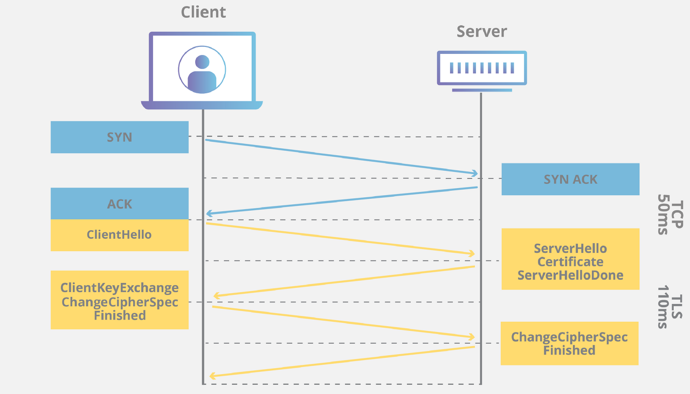

# TLS/SSL란?

---

- SSL(Secure Sockets Layer)은 Certificate Authority(CA)라 불리는 서드 파티로부터 서버와 클라이언트의 인증을 하는데 사용된다.
    - SSL 인증서 : 클라이언트와 서버간의 통신을 제 3자가 보증화 해주는 전자화된 문서이다.
        - 클라이언트가 접속한 서버가 신뢰할 수 있는 서버인지 판단하고 SSL 통신에 사용될 공개키를 클라이언트에게 전달하는 것
        - 구성요소 : 서비스의 정보(CA, 도메인), 서버측 공개키
    - CA : 인증서의 역할은 클라이언트가 접속한 서버가 의도한 서버가 맞는지 보장하는 것이고 이러한 일을 해주는 공인된 회사들을 CA라 한다.
- TLS(Transport Layer Security)는 SSL의 과거 명칭이다.

### 신뢰 확인 과정

1. 웹 브라우저 서버에 접속
2. 서버는 SSL 인증서 제공(해당 인증서에 서버측의 공개키와 서비스의 정보를 담고있다)
3. 브라우저는 이 인증서를 발급한 CA가 자신의 CA리스트에 있는지 확인
4. CA리스트에 존재하면 해당 공개키로 인증서를 복호화 → 복호화가 된다면 인증서는 CA의 비공개키에 의해 암호화 된것 

# SSL Handshake

---

)
1. 🤷‍♀️Client) Client Hello 
    
    client에서 SSL버전 정보와 지원하는 암호화 방식, 무작위 바이트 문자열, 세션 ID, SNI(서버명)이 포함되어 전달한다. 
    
    - 무작위 바이트 문자열 : 클라리언트에서 생성한 난수로 대칭키를 만들 때 사용
    - 이전에 SSL handshake를 했다면 세션 재사용 가능(포함된 세션 ID가 유효)
2. 🖥️Server) Server Hello 
    
    지원하는 암호화 방식 중 서버에서 어떤 것을 사용할 지, 세션 ID, 서버측에서 생성한 무작위 바이트 문자열은 전송한다
    
3. 🖥️Server) Certificate 
    
    클라이언트에서 인증서를 요구하면 SSL 인증서를 전송하게 된다.
    
4. 🖥️Server) ServerHelloDone 
    
    서버가 클라이언트에 보낼 메시지를 모두 보냈다는 것
    
5. 🤷‍♀️Client) ClientKeyExchange
    
    인증서가 무결한지 검증되면 클라이언트 난수와 서버의 난수를 조합해 대칭키를 생성(pre-master secret)하고 해당 대칭키를 서버의 공개키로 암호화한다. 
    
    암호화된 정보를 서버에 전송한다. 
    
6. 🤷‍♀️Client&🖥️Server) ChangeCipherSpec
    
    이제부터 전송되는 모든 패킷은 협상된 알고리즘과 키를 이용해 암호화 하겠다고 알리는 메시지
    
7. 🤷‍♀️Client&🖥️Server) Finished
    
    TLS Handshake를 성공적으로 마치고 종료
    

참고

https://hanjungv.github.io/2017-11-07-1_CS_SSL/
[https://sunrise-min.tistory.com/entry/TLS-Handshake는-어떻게-진행되는가](https://sunrise-min.tistory.com/entry/TLS-Handshake%EB%8A%94-%EC%96%B4%EB%96%BB%EA%B2%8C-%EC%A7%84%ED%96%89%EB%90%98%EB%8A%94%EA%B0%80)
