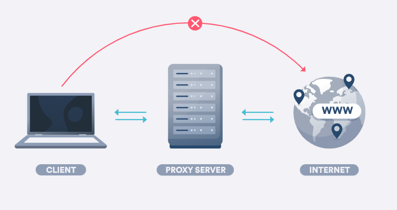

# 프록시 서버란?

---

장치와 인터넷 웹 사이트 간의 중개자 역할을 해 모든 발신 및 수신 데이터가 프록시 서버를 통과한다. 클라이언트 IP가 프록시 서버의 IP로 대체되어 온라인 시스템이 장치가 아닌 서버에서 연결하고 있다고 생각하게 한다. 

→ 사용자와 인터넷 사이에서 중간 서버 역할

### 작동

1. 브라우저에 웹 사이트 주소를 입력한다.
2. 프록시 서버가 사용자의 요청을 받는다.
3. 프록시 서버는 액세스하려는 웹 서버로 요청을 전달한다.
4. 웹 서버는 응답(웹 사이트 데이터)을 프록시 서버로 보낸다.
5. 프록시 서버가 사용자에게 응답을 전달한다. 

### 사용 이유

- 우회 : 특정 IP 주소가 차단하면 프록시 서버에 연결해 우회 접속을 할 수 있다.
- 온라인 보안 : 프록시는 온라인에서 악의적인 공격을 방어하는 방화벽 역할을 할 수 있다. 또한 장치의 온라인 주소(IP)를 가려 보안을 강화할 수 있다.
- 인터넷 사용 제어 : 일부 웹 주소를 금지해 프록시를 통해 실행되는 네트워크를 사용하는 사림이 가지 못하도록 한다.
- 속도향상, 대역폭 절약 : 프록시 서버거 자주 액세스하는 웹사이트 복사본을 캐시로 저장한다.  또한, 여러명의 사용자가 웹페이지를 방문할 경우 사용자에게 정보를 분배해 네트워크 부하를 줄인다.

참고

https://surfshark.com/ko/blog/proxy-server
