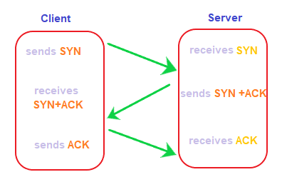
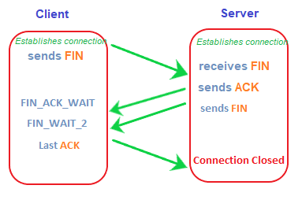

# TCP 3 way handshake & 4 way handshake

TCP(전송 제어 프로토콜)는 질서 있고 안전한 방식으로 데이터 전송을 보장하는 전송 프로토콜로써 동일한 순서로 데이터 패킷을 보내고 받는다. TCP는 7계층 OSI 중 4계층(전송) 프로토콜로, 서버와 클라이언트 간의 무결성 및 보안으로 인해 높은 수준의 프로토콜에서 데이터를 전송할 수 있도록 한다. 이러한 TCP는 연결을 설정하려면 TCP에 3방향 핸드셰이크가 필요하고, 종료를 위해서는 4방향 핸드셰이크가 필요하다. 

##  TCP란?

- TCP 는 연결 지향 프로토콜이다. 즉, 먼저 핸드셰이크 형태로 발신자와 수신자 간의 연결을 설정한 뒤, 두 연결이 모두 확인되면 패킷 전송을 시작한다. 전송 프로세스를 오류 없이 만들고 데이터 전달을 보장한다. 
- TCP 는 종단 간 전달을 보장하는 가장 일반적인 프로토콜 중 하나로 전송되는 데이터의 보안과 무결성을 보장한다. 따라서 TCP는 FTP (File Transfer Protocol) , HTTP (Hyper Text Transfer Protocol) 및 SMTP (Simple Mai Transfer Protocol) 와 같은 대부분의 고급 프로토콜에서 사용된다.

## 3 way handshake : 연결

핸드셰이크는 클라이언트와 서버 간의 연결을 설정하는 프로세스를 나타낸다. 핸드셰이크는 단순히 통신 링크를 설정하는 프로세스로 정의되며 패킷을 전송하기 위해 TCP는 데이터 전송을 시작하기 전에 3방향 핸드셰이크가 필요하다. 

TCP에서 안정적인 통신을 PAR (Positive Acknowledgement Re-transmission) 이라고 하는데 이는 발신자가 수신자에게 데이터를 보낼 때 데이터 도착을 확인하는 수신자의 긍정적인 승인이 필요로 한다. 이때 승인이 발신자에게 도달하지 않은 경우 해당 데이터를 다시 보내야 한다. 수신자의 긍정적인 승인은 성공적인 연결을 설정한다.

3방향 핸드셰이크는 일반적으로 SYN-SYN-ACK로 알려져 있으며 데이터를 교환하려면 클라이언트와 서버 응답이 모두 필요하다. SYN은 동기화 시퀀스 번호를 의미 하고 ACK는 승인을 의미한다. 

> 1단계 SYN
- SYN은 클라이언트에서 서버로 보내는 세그먼트로 클라이언트와 서버 간의 연결 요청 역할을 한다. 클라이언트가 연결을 설정하기를 원한다는 것을 서버에 알린다.

> 2단계 SYN ACK
- 서버에서 보낸 세그먼트는 SYN-ACK 세그먼트 또는 SYN+ACK 세그먼트라고 한다. ACK 세그먼트는 클라이언트에게 서버가 연결 요청을 받았고 연결을 구축할 준비가 되었음을 알린다. SYN 세그먼트는 서버가 세그먼트를 시작할 준비가 된 시퀀스 번호를 알려준다.

> 3단계 ACK 
- ACK(Acknowledgement)는 클라이언트와 서버 간에 성공적인 TCP 연결을 설정하기 전 마지막 단계이다. ACK 세그먼트는 서버에서 받은 ACK 및 SN에 대한 응답으로 클라이언트에서 보내게 된다.이때  신뢰할 수 있는 데이터 연결이 설정된다. 
- 이 세 단계 후에 클라이언트와 서버는 데이터 통신 프로세스를 위한 준비가 완료되며 TCP 연결 및 종료는 전이중 방식이므로 데이터가 양방향으로 동시에 이동할 수 있다.

### 4 way handshake : 종료

모든 장치는 종료를 진행하기 전에 연결을 설정한다. TCP는 데이터를 보내기 전에 클라이언트와 서버 간의 연결을 설정하기 위해 3방향 핸드셰이크가 필요하다. 마찬가지로 데이터 전송을 종료하거나 중지하려면 4방향 핸드셰이크가 필요하다. 

TCP 종료에 필요한 세그먼트는 FIN 세그먼트를 제외하고는 TCP 연결을 구축하기 위한 세그먼트(ACK 및 SYN)와 유사하다. FIN 세그먼트는 한 장치에서 다른 장치로 보낸 종료 요청을 지정한다.

> 1단계 FIN
- FIN은 클라이언트가 서버에 보낸 종료 요청을 나타낸다. 첫 번째 FIN 종료 요청은 클라이언트에서 서버로 전송되며 클라이언트와 서버 간의 종료 프로세스 시작을 나타낸다.

> 2단계 FIN_WAIT_1
- 클라이언트는 서버에서 FIN 종료 요청의 ACK를 기다린다. 이때  클라이언트 대기 상태를 유지한다.

> 3단계 ACT
- 서버는 FIN 종료 요청을 받으면 ACK(Acknowledgement) 세그먼트를 보내고 서버가 연결을 닫고 종료할 준비가 되었음을 나타낸다.

> 4단계 FIN_WAIT_2
- 클라이언트는 서버에서 FIN 세그먼트를 기다린다. 이는 서버가 연결을 종료할 준비가 되었음을 나타내는 서버에서 보내는 일종의 승인된 신호이다.

> 5단계 FIN
- FIN 세그먼트가 서버에서 클라이언트로 전송된다. 이는 서버가 클라이언트에게 보내는 확인 신호이며 종료에 대한 성공적인 승인을 나타낸다.

> 6단계 ACT
- 클라이언트는 연결을 종료하라는 서버의 신호인 FIN 신호를 수신했다는 ACK(Acknowledgement) 세그먼트를 서버로 보내고 서버는 ACK 세그먼트를 수신하는 즉시 연결을 종료한다.
