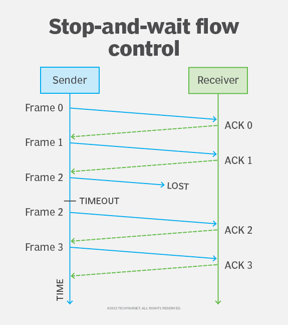

# TCP/IP 흐름제어 & 혼잡제어

## 흐름제어란?
흐름 제어란 컴퓨터 또는 네트워크의 다른 노드 간의 데이터 전송을 규제하는 데 사용되는 기술로써 전송 장치가 처리할 수 있는 것보다 더 많은 데이터를 수신 장치로 보내지 않도록 한다.
흐름 제어의 목적은 수신자의 리소스가 과도하게 사용되지 않도록 전송되는 데이터의 양을 제한하는 것으로 이는 프레임이 수신되었는지 확인하기 위해 수신자가 발신자에게 전송하는 일련의 메시지를 통해 수행된다.
흐름제어에는 stop and wait flow control과 sliding window가 대표적인 방식으로 존재하며 전자의 경우가 간단하지만 후자에 비해 네트워크 리소스 사용 효율이 떨어진다.

### 1. stop and wait flow control
Stop-and-wait 접근 방식에서 송신자는 데이터를 프레임으로 분할한 다음 한 번에 하나의 프레임을 수신자에게 전송하고 수신자는 각 프레임에 ACK 메시지로 응답한다. 이때 아래와 같은 프로세스로 수행된다.



```
1. 송신자는 데이터 프레임을 수신자에게 전송한다.
2. 보낸 사람은 받는 사람의 응답을 기다린다.
3. 프레임을 수신하면 수신자는 송신자에게 ACK를 전송한다.
4. 송신자는 ACK를 받으면 수신자에게 다음 프레임을 보내고 다음 ACK를 기다린다. 보낸 사람이 제한 시간 으로 알려진 정의된 시간 제한 내에 ACK를 받지 못하면 보낸 사람은 동일한 프레임을 다시 전송한다.
5. 송신자가 수신자에게 모든 데이터 전송을 완료할 때까지 프로세스가 계속된다.
```

### 2. stop and wait flow control
슬라이딩 윈도우 접근 방식은 송신자가 각 프레임에 대한 ACK를 기다릴 필요 없이 한 번에 여러 프레임을 전송할 수 있기 때문에 정지 및 대기와 관련된 많은 문제를 해결할 수 있다. 하지만 해당 방식은 복잡하다.


1. 처음 연결할 때 발신자와 수신자는 발신자가 한 번에 전송할 수 있는 최대 프레임 수를 결정하는 창을 설정한다. 전송하는 동안 발신자와 수신자는 모든 데이터가 목적지에 도달하고 올바른 순서로 재조립되도록 어떤 프레임이 전송되고 수신되었는지 추적이 필요하다.


2. 슬라이딩 윈도우 흐름 제어는 Go-Back-N 및 선택적 반복의 두 가지 접근 방식 중 하나를 사용하여 구현할 수 있다.

    > Go_Back_N
    - Go-Back-N 접근 방식을 사용하면 발신자는 하나 이상의 프레임을 보낼 수 있지만 창에서 허용하는 것보다 더 많은 프레임을 보낼 수는 없다. 수신자가 프레임을 확인하면 발신자는 지금 보낼 수 있는 프레임의 다음 배치 또는 창으로 이동한다. 전송된 프레임에 문제가 있는 경우 송신자는 현재 창의 모든 프레임을 재전송한다.

    > 선택적 반복
    - 선택적 반복 접근 방식은 Go-Back-N과 유사하다. 주된 차이점은 선택적 반복이 오류가 있는 경우 전체 창을 재전송하지 않고 분쟁 중인 개별 프레임만 재전송한다는 것이다. 선택적 반복은 Go-Back-N과 같은 누적 ACK 메시지를 지원하지 않으므로 각 ACK는 방금 수신한 프레임에 따라 다르므로 발신자가 재전송해야 하는 정확한 프레임을 식별할 수 있다.

    - Selective Repeat와 Go-Back-N 모두 stop-and-wait 접근 방식보다 더 효율적이지만 두 개의 슬라이딩 윈도우 접근 방식 간에는 중요한 차이점이 존재한다. Go-Back-N 접근 방식은 오류가 발생하면 창의 모든 프레임이 재전송되기 때문에 더 많은 대역폭을 사용할 수 있다. 하지만 선택 반복만큼 구현이 복잡하지 않으며 같은 양의 시스템 리소스가 필요하지 않다. 선택적 반복은 데이터 전송 전체에서 프레임을 추적하고 정렬해야 하므로 관리 오버헤드가 더 큰 단점이 존재한다.


## 혼잡제어란?
데이터의 양이 라우터가 처리할 수 있는 양을 초과하면 초과된 데이터는 라우터가 처리하지 못한다. 이때 송신 측에서는 라우터가 처리하지 못한 데이터를 손실 데이터로 간주하고 계속 재전송하고 네트워크가 혼잡하게 된다. 혼잡제어는 이러한 상황을 제어하는 것을 뜻한다.

### AIMD algorithm
- AIMD 방식은 처음에 패킷을 하나씩 보내고 문제 없이 도착하면 윈도우의 크기를 1씩 증가시켜가며 전송한다. 만약, 전송에 실패하면 윈도우 크기를 반으로 줄인다. 윈도우 크기를 너무 조금씩 늘리기 때문에 네트워크의 모든 대역을 활용하여 제대로 된 속도로 통신하기까지 시간이 오래 걸린다는 단점이 있다.

아래는 TCP 혼잡제어의 구성요소 3가지이다.
### 1. slow start
- 해당 알고리즘은 1로 설정된 initcwnd로 시작하여 ssthresh (Slow Start 임계값) 에 도달할 때까지 성공적인 모든 ACK 후 cwnd를 두 배로 늘린 다음 모든 ACK에서 cwnd를 1MSS씩 선형적으로 증가시킨다. 손실이 감지되면 ssthresh는 그 때 cwnd의 절반으로 설정되고 cwnd는 감소한다.

### 2. congestion avoidance
- 해당 상태로 들어가는 시점에서 cwnd값은 마지막으로 발견된 시점의 절반이 된다. 그러므로 매 RTT마다 cwnd값을 두배로 하기보다는 TCP는 좀 더 보수적인 접근법을 채택하여 매 RTT마다 하나의 MSS만큼 cwnd값을 증가시킨다. > 언제까지 증가하는가? TCP는 cwnd값을 반으로 하고 ssthresh값을 3개의 중복 응답들을 수신한 시점에서의 cwnd값의 반으로 한다.

### 3. fast recovery
- 빠른 회복에서 cwnd값은 잃었던 세그먼트( TCP를 빠른 회복상태로들어가게 한 세그먼트 ) 에 대한 매 중복된 응답을 수신할 때마다 1MS씩 증가된다. 만약 타임아웃이 발생한다면 빠른 회복은 슬로스타트와 혼잡회피에서와 같은 동작을 수행한 후에 슬로 스타트로 전이한다. 즉 cwnd값은 1MSS로 하고 ssthresh값은 손실이벤트가 발생할때의 cwnd값의 절반으로 한다. 빠른 회복은 권고 사항이지만 필수는 아닌 요소이다. 새로운 TCP버전인 TCP Reno에서는 해당 방식을 채택하였다.