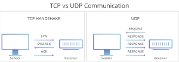

# UDP
사용자 데이터그램 프로토콜(UDP)은 통신 프로토콜로, 특히 비디오 재생 또는 DNS 조회와 같이 시간에 민감한 전송을 위해 인터넷을 통해 사용된다. 이 프로토콜의 경우 데이터가 전송되기 전에는 공식적으로 연결이 설정되지 않으므로 통신 속도가 빨라진다. 따라서 데이터를 아주 빠르게 전송할 수 있지만, 전송 중에 패킷이 손실되어 DDoS 공격의 형태로 악용될 수도 있다.

## UDP 동작 방식

> 다른 프로토콜과 비교하여 UDP는 먼저 연결을 설정하거나, 해당 패킷의 순서를 표시하거나, 의도한 대로 도착했는지 여부를 확인하지 않고 패킷(데이터 전송 단위)을 대상 컴퓨터로 직접 보내는 간단한 방식으로 동작한다.

- UDP는 또 하나의 일반적인 전송 프로토콜인 TCP보다 빠르지만, 안정성이 떨어진다. TCP 통신에서 두 컴퓨터는 '핸드셰이크'라는 자동화된 프로세스를 통해 연결을 설정하는 것으로 시작합니다. 이 핸드셰이크가 완료된 후에만 실제로 데이터 패킷이 한 컴퓨터에서 다른 컴퓨터로 전송되지만 UDP 통신은 이 프로세스를 거치지 않는다. 대신 한 컴퓨터에서 단순히 다른 컴퓨터로 데이터를 보내기 시작할 수 있다.
- UDP는 '핸드셰이크'가 필요하지 않거나 데이터가 제대로 도착하는지 확인하지 않기 때문에 TCP보다 훨씬 빠르게 데이터를 전송할 수 있다.
- 하지만 이 속도 때문에 성능 저하가 생기는 문제가 있다. UDP 데이터그램이 전송 중에 손실되면 다시 전송되지 않고 따라서 UDP를 사용하는 애플리케이션은 오류, 손실, 중복을 허용할 수 있어야 한다.

